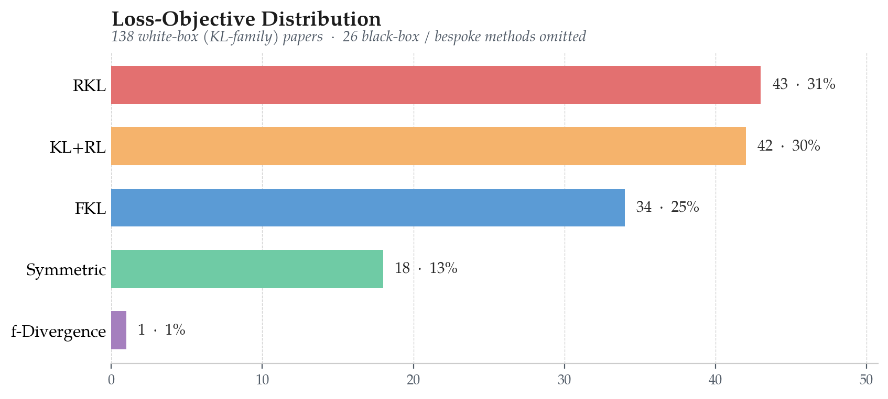
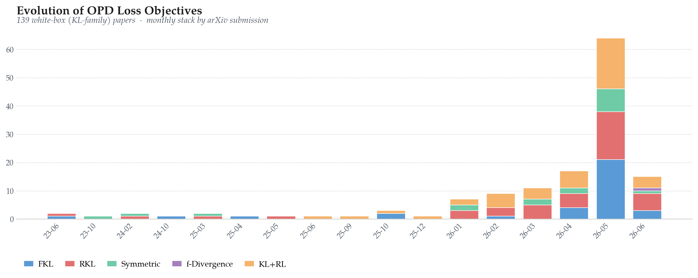

<a id="readme-top"></a>

# Awesome LLM On-Policy Distillation

A curated reading list for **[A Survey of On-Policy Distillation for Large Language Models](https://arxiv.org/abs/2604.00626)**.

[](https://github.com/nick7nlp/Awesome-LLM-On-Policy-Distillation) [](LICENSE) 

[Search and filter on OPDHub](https://nick7nlp.github.io/OPDHub/) · [Reading paths](resources/reading-order.md) · [Method comparison](resources/method-comparison.md) · [Code index](resources/codebases.md) · [Equations](resources/key-equations.md) · [Evaluation guide](resources/benchmarks.md)

**Updated 2026-10-06.** 210 method, analysis, and application entries plus 25 foundational or related resources. Coverage through September 2026. These are reading-list entries, not a count of distinct direct-OPD algorithms. The public survey PDF is arXiv v4; this catalog includes later literature.

## News

- **2026-10-06** — Updated paper versions, method descriptions, and reading sections across the catalog and OPDHub. The collection contains 235 entries, with source and implementation links and citation export. [Browse the reading list](https://github.com/nick7nlp/Awesome-LLM-On-Policy-Distillation)
- **2026-10-05** — The reading catalog now covers literature through September 2026. OPDHub offers updated search, reading sections, and citation export. [Explore OPDHub](https://nick7nlp.github.io/OPDHub/)
- **2026-06-18** — Survey v4 is available on arXiv, expanding the literature coverage and discussions of on-policy distillation. [Read survey v4](https://arxiv.org/abs/2604.00626v4)
- **2026-05-18** — Survey v3 is available on arXiv. [Read survey v3](https://arxiv.org/abs/2604.00626v3)
- **2026-05-12** — Survey v2 is available on arXiv. [Read survey v2](https://arxiv.org/abs/2604.00626v2)
- **2026-04-01** — The first version of A Survey of On-Policy Distillation for Large Language Models is available on arXiv. [Read survey v1](https://arxiv.org/abs/2604.00626v1)

## Scope and how to use the list

The central topic is teacher-derived learning on states visited by an evolving language-model student. Direct distribution matching, hybrid OPD, teacher-mediated rewards, analysis, and deployment reports are labeled by their actual role. Necessary off-policy comparators are identified explicitly. The collection focuses on contributions that help readers compare these mechanisms and their evidence.

Dates below denote first public release. Each entry links to its source paper; repository links identify associated implementations or resources. Unofficial reproductions are labeled, and a dash means no repository is listed. Individual papers state their experimental conditions and limitations.

<p align="center"></p>

*Conceptual illustration of one direct-matching loop. Teacher feedback is not certified ground truth; other methods use different targets, divergences, or teacher-mediated rewards.*

## Start here

- [GKD](https://arxiv.org/abs/2306.13649): distinguish the sampled prefix distribution from the chosen conditional divergence.
- [MiniLLM](https://arxiv.org/abs/2306.08543): follow sequence reverse KL, future returns, and the practical estimator.
- [Rethinking OPD](https://arxiv.org/abs/2604.13016): examine teacher–student reasoning compatibility and failure modes.
- [GAD](https://arxiv.org/abs/2511.10643): compare teacher-text-derived discriminator rewards with direct logit matching.
- [MemOPD](https://arxiv.org/abs/2608.07068): inspect memory-state reconstruction before teacher scoring.

## Teacher–Student Model Atlas

An overview of teacher and student model combinations in the **June 2026 catalog snapshot**. Rows represent teacher models, columns represent student models, and cells show reported pair occurrences. This historical snapshot is not a count of the current catalog or a ranking of model quality.

<p align="center"><a href="assets/model-atlas-heatmap.png"></a></p>

Same-name teacher and student labels can use different conditioning information. Open the image for a larger view.

## Browse the catalog

- [Objectives and update rules](#papers-4) — 50 entries
- [Teacher and supervision construction](#papers-5) — 60 entries
- [Data and training dynamics](#papers-6) — 33 entries
- [Agentic and multi-turn distillation](#papers-7) — 23 entries
- [Mechanisms, failures, and evaluation](#papers-8) — 28 entries
- [Applications and systems](#papers-9) — 16 entries
- [Foundations and related background](#papers-background) — 25 entries

[Latest additions and update notes](CHANGELOG.md) · [Objective index](resources/loss-taxonomy.md) · [Related surveys](resources/related-surveys.md) · [Contributing](CONTRIBUTING.md)

## Recent literature

The most recent release dates in the collection.

| Paper | Released | Reading section |
|---|---|---|
| [Not Every Token Is Worth Distilling: Selective Supervision for Direct-OPD](https://arxiv.org/abs/2609.29142) | 2026-09-24 | [Data and training dynamics](#papers-6) |
| [LastOPD: Taming Collapse in Latent On-Policy Distillation](https://arxiv.org/abs/2609.28845) | 2026-09-23 | [Teacher and supervision construction](#papers-5) |
| [RL Starts before RL: On Policy Distillation for Better Reinforcement Learning](https://arxiv.org/abs/2609.28145) | 2026-09-23 | [Mechanisms, failures, and evaluation](#papers-8) |
| [Counterfactual Constraint-Conditioned On-Policy Distillation for Multi-Constraint Instruction Following](https://arxiv.org/abs/2609.27421) | 2026-09-23 | [Teacher and supervision construction](#papers-5) |
| [Train Where the Quantized Model Goes: On-Policy Distillation for Low-Bit Reasoning](https://arxiv.org/abs/2609.26708) | 2026-09-22 | [Applications and systems](#papers-9) |
| [1% of Tokens Can Be Enough: On Gradient Estimation in On-Policy Distillation](https://arxiv.org/abs/2609.24432) | 2026-09-21 | [Objectives and update rules](#papers-4) |
| [Distill What You Trust: Reliability-Aware Multi-Teacher On-Policy Distillation](https://arxiv.org/abs/2609.23697) | 2026-09-20 | [Teacher and supervision construction](#papers-5) |
| [One to More, More to One: Category-Aware Iterative Expert Training for Software Engineering Agents](https://arxiv.org/abs/2609.23377) | 2026-09-20 | [Applications and systems](#papers-9) |
| [When EOS Tokens Disagree: Understanding Length Inflation in On-Policy Distillation](https://arxiv.org/abs/2609.20511) | 2026-09-17 | [Mechanisms, failures, and evaluation](#papers-8) |
| [Beyond Token-Local Imitation: Reward-Compatible Temporal Credit Assignment for On-Policy Distillation](https://arxiv.org/abs/2609.16937) | 2026-09-15 | [Objectives and update rules](#papers-4) |
| [OPD-Aha: From Linguistic Momentum to Visual Reflection in Multimodal On-Policy Distillation](https://arxiv.org/abs/2609.16459) | 2026-09-15 | [Teacher and supervision construction](#papers-5) |
| [Who Teaches Which Token? Verifier-Gated Multi-Expert On-Policy Distillation for Scientific Reasoning](https://arxiv.org/abs/2609.15404) | 2026-09-14 | [Teacher and supervision construction](#papers-5) |

<a id="papers-4"></a>

## Objectives and update rules

| Paper and contribution | First release | Role | Repository |
|---|---|---|---|
| [1% of Tokens Can Be Enough: On Gradient Estimation in On-Policy Distillation](https://arxiv.org/abs/2609.24432)<br><sub>This study separates useful teacher corrections from the reliability of estimating their gradients from sampled tokens. It approximates a fixed-prefix signal-to-noise measure to select positions in student rollouts, alone or with usefulness scores; sparse supervision still requires generating and scoring complete trajectories in its implementation.</sub> | 2026-09-21 | Direct OPD | [Repository](https://github.com/BruceSheng1202/IER-OPD) |
| [Beyond Token-Local Imitation: Reward-Compatible Temporal Credit Assignment for On-Policy Distillation](https://arxiv.org/abs/2609.16937)<br><sub>The paper analyzes why token-local distillation credit omits a token's effects on later prefixes, then proposes discounted future teacher credit mixed with verifiable outcome feedback. Its horizon-independent variance bound applies to a fixed discount below one under the paper's assumptions, not to undiscounted credit.</sub> | 2026-09-15 | Hybrid OPD | — |
| [TV-Regulated OPD: Direction Matters in On-Policy Distillation](https://arxiv.org/abs/2609.08341)<br><sub>The paper tests whether sampled-token likelihood-gap magnitudes matter beyond their signs, then uses teacher-relative signs with conditional total variation to regulate overall update intensity. Its gradient interpretation concerns the on-policy signal with fixed state occupancy, not a full sequence-level derivative.</sub> | 2026-09-08 | Direct OPD | — |
| [Distillation as Probability Transport: Routed On-Policy Distillation](https://arxiv.org/abs/2609.08337)<br><sub>On student-visited prefixes, the method pairs tokens with excess student probability with tokens underweighted relative to the teacher, then fits localized pairwise log-odds changes to consistent, bounded targets. Its routing uses a sparse shared token support and is evaluated on mathematical reasoning.</sub> | 2026-09-08 | Direct OPD | — |
| [Influence-Directed Distillation: Solving the Diversity Bottleneck in Sampled-Token On-Policy Distillation](https://arxiv.org/abs/2608.29846)<br><sub>IDA-OPD estimates each sampled-token update’s local entropy effect, preserves entropy-expanding updates, and shrinks contracting advantages according to teacher–student disagreement. The entropy sign result assumes a local logit-space step; behavior under full model training is evaluated empirically.</sub> | 2026-08-30 | Direct OPD | — |
| [SpikeOPD: Stable On-Policy Distillation for Autoregressive Spiking Language Models](https://arxiv.org/abs/2608.27857)<br><sub>SpikeOPD adapts a distilled spiking language model on its own generated prefixes, combining teacher distribution matching with an anchor to the initial distilled checkpoint and layerwise firing-rate constraints. Its stability findings concern the evaluated spiking students, not language-model architectures generally.</sub> | 2026-08-28 | Direct OPD | — |
| [On-policy Distillation with Verifiable Reward](https://arxiv.org/abs/2608.24696)<br><sub>On student-generated reasoning trajectories, this method gates each sampled token’s teacher–student log-probability signal by verified correctness, retaining updates that reinforce correct responses or suppress incorrect ones. Its group-relative variant uses the sign, not the magnitude, of the group advantage; the reported tests concern mathematical reasoning.</sub> | 2026-08-25 | Hybrid OPD | [Repository](https://github.com/LeapLabTHU/OPDVR) |
| [Beyond Teacher Likelihood: Group-Calibrated On-Policy Distillation for Long-Context Reasoning](https://arxiv.org/abs/2608.19181)<br><sub>GC-OPD separately normalizes verifier rewards and mean teacher–student token scores within student rollout groups. It distributes their signed difference across tokens while retaining the original distillation advantage; the correction vanishes when either group-level signal has negligible variation.</sub> | 2026-08-19 | Hybrid OPD | [Repository](https://github.com/SolereZhang/GC-OPD) |
| [Mismatch Matters: On-Policy Distillation Beyond Token Agreement](https://arxiv.org/abs/2608.09836)<br><sub>TIDE diagnoses repetitive rollouts where local teacher agreement masks failure, then independently gates severe student-excess and student-deficit positions. It uses bounded Hellinger-shaped sampled-token suppression and teacher top-K cross-entropy to recover missing mass; its experiments concern mathematical reasoning with fixed external teachers.</sub> | 2026-08-10 | Direct OPD | [Repository](https://github.com/yzc-666/TIDE) |
| [SR-OPSD: Self-Referenced On-Policy Self-Distillation](https://arxiv.org/abs/2608.09745)<br><sub>On student-generated prefixes, SR-OPSD geometrically mixes a privileged-context self-teacher with a frozen initial-policy reference, then minimizes forward Rényi divergence from that target to the student. Its variational characterization applies to fixed rollout contexts, not the full moving-policy dynamics.</sub> | 2026-08-10 | Direct OPD | — |
| [WDL-OPD: Weak-Driven On-Policy Distillation via Mixture-Constrained Co-Training](https://arxiv.org/abs/2608.09447)<br><sub>An anchor policy supplies all rollouts while a trainable auxiliary evaluates the same prefixes; both receive gradients from matching their geometric token-distribution mixture to a frozen teacher. The reported stability evidence is descriptive because initialization, curriculum, and compute are not fully matched across comparisons.</sub> | 2026-08-10 | Direct OPD | — |
| [Matching Supervision to the Student's Learning Capacity: A Unified Framework for On-Policy Self-Distillation](https://arxiv.org/abs/2608.08176)<br><sub>The method jointly adjusts soft token weights and how much reference context a privileged self-teacher sees while scoring student rollouts. A fixed learning-difficulty budget drives both controls through online updates; it is a capacity model, not a measured or automatically changing student-capacity limit.</sub> | 2026-08-08 | Direct OPD | [Repository](https://github.com/lauvlalala/USD) |
| [SPOT: Sparse Probing and Outcome Calibration for On-Policy Distillation](https://arxiv.org/abs/2608.04419)<br><sub>SPOT ranks student-generated positions for sparse probing using teacher entropy, top-candidate mass and student–teacher mismatch. Verifier-scored student continuations then tilt a teacher-anchored target for an additional local distillation loss, applied only at selected positions with a positive-reward branch.</sub> | 2026-08-05 | Direct OPD | — |
| [DAPD: Dual-Anchored Policy Distillation](https://arxiv.org/abs/2608.01735)<br><sub>DAPD addresses privilege illusion in on-policy self-distillation with a trainable, self-conditioned bridge. It aligns reference and rollout behavior along inference-context and privileged-context paths in both guidance directions, while retaining the original privileged-teacher supervision rather than replacing it entirely.</sub> | 2026-08-03 | Hybrid OPD | [Repository](https://github.com/uanu2002/DAPD) |
| [Distill What the Student Can See: Fisher-Projected On-Policy Distillation for Vision-Language Models](https://arxiv.org/abs/2608.01263)<br><sub>FP-OPD estimates a vision-language student’s local visual-response space with perturbation probes, then Fisher-projects the teacher correction to construct targets for student-generated prefixes. It models local reachability rather than global representational capacity, and the probes require additional forward passes.</sub> | 2026-08-02 | Direct OPD | — |
| [CriPO: Enhancing Rubric-based RL via Self-Distillation](https://arxiv.org/abs/2607.18082)<br><sub>CriPO retains rubric-reward policy optimization on policy-generated responses. A criterion-conditioned self-teacher supplies filtered forward-KL supervision for unmet criteria, while a counterfactual self-teacher locates useful tokens in negative-advantage responses for local advantage flipping. It is a hybrid update, not standalone distillation.</sub> | 2026-07-20 | Hybrid OPD | — |
| [When Top-K Misses the Decision: Tool-Call Drift in Multi-Teacher On-Policy Distillation](https://arxiv.org/abs/2607.07050)<br><sub>The study diagnoses decision-critical coordinates omitted by teacher-only top-K support and compares support restoration with loss shaping. In the reported Qwen setting, Soft Clamp lowers over-calling from 14.2% to 9.0% while lowering required-call recall from 91.5% to 86.5%.</sub> | 2026-07-08 | Analysis | [Repository](https://github.com/shen-jiabin/decision-support-opd) |
| [Geometric Self-Distillation for Reasoning Generalization](https://arxiv.org/abs/2607.06855)<br><sub>GEOSD combines Hellinger matching, a Fisher–Rao penalty to recent checkpoints, and damped K-FAC preconditioning on student-generated prefixes. Geometric-mean token weights alone do not bound the parameter-gradient norm; objective and optimizer ablations evaluate the recipe.</sub> | 2026-07-07 | Direct OPD | — |
| [Trust Region Policy Distillation](https://arxiv.org/abs/2607.04751)<br><sub>TOP-D interpolates an external teacher’s token probabilities with the rollout student’s to lower-bound the negative log-ratio reward, then uses clipped trust-region updates to reuse student-generated batches. Its gradient-variance analysis concerns autoregressive generation and assumes bounded score-function gradients and a finite vocabulary.</sub> | 2026-07-06 | Analysis | — |
| [PowerOPD: Stabilizing On-Policy Distillation with Bounded Power Transformation](https://arxiv.org/abs/2606.17199)<br><sub>PowerOPD replaces the detached teacher–student log-ratio coefficient on student-sampled tokens with a bounded, sign-preserving difference of powered token probabilities in a policy-gradient update. Its evaluations focus on mathematical reasoning and a limited set of teacher–student pairs.</sub> | 2026-06-15 | Direct OPD | [Repository](https://github.com/EIT-NLP/PowerOPD) |
| [RLCSD: Reinforcement Learning with Contrastive On-Policy Self-Distillation](https://arxiv.org/abs/2606.11709)<br><sub>RLCSD uses a frozen self-teacher to contrast dataset-provided correct solutions with incorrect same-query student rollouts. The resulting sampled-token signal modulates verifier-derived advantages through a sign-preserving clamp and a two-path clipped policy loss.</sub> | 2026-06-10 | Teacher-mediated RL | [Repository](https://github.com/THU-BPM/RLCSD) |
| [When Context Returns: Toward Robust Internalization in On-Policy Distillation](https://arxiv.org/abs/2606.11627)<br><sub>After on-policy context distillation, reintroducing privileged context can worsen a student's answers. No-Context Anchoring adds a forward-KL consistency loss that treats the student's no-context output as a stop-gradient target for its context-conditioned output on reused student rollouts; it does not guarantee invariance.</sub> | 2026-06-10 | Direct OPD | — |
| [SafeSteer: Localized On-Policy Distillation for Efficient Safety Alignment](https://arxiv.org/abs/2606.02530)<br><sub>SafeSteer builds a refusal-oriented self-teacher by activation steering, then votes on teacher–base-model probability contrasts to select safety-related vocabulary items. On student-generated responses to harmful prompts, it applies reverse-KL loss only over those items, rather than restricting generation or scoring to them.</sub> | 2026-06-01 | Direct OPD | — |
| [Trust Region On-Policy Distillation](https://arxiv.org/abs/2606.01249)<br><sub>TrOPD classifies student-generated tokens by teacher–student decoding agreement, using sampled reverse-KL supervision in the trust region and top-k forward-KL guidance for outliers. It also imitates teacher-generated prefixes before student continuations, annealing those prefixes away during training.</sub> | 2026-05-31 | Hybrid OPD | — |
| [OPD+: Rethinking the Advantage Design for On-Policy Distillation](https://arxiv.org/abs/2606.01039)<br><sub>OPD+ studies policy-gradient coefficients for student-sampled, single-token estimates of teacher–student f-divergences and restores the omitted direct dependence of divergence feedback on the student. For reverse KL the correction is a constant baseline in expectation; this immediate-token analysis does not by itself settle full-trajectory credit.</sub> | 2026-05-31 | Direct OPD | — |
| [Visual-Advantage On-Policy Distillation for Vision-Language Models](https://arxiv.org/abs/2605.21924)<br><sub>On student-generated vision-language rollouts, a teacher compares token probabilities with intact and degraded images to estimate sensitivity to fine visual detail. The method reweights sibling rollouts and separately averages reverse KL over high- and low-sensitivity tokens; sensitivity is a proxy, not a direct measure of perception.</sub> | 2026-05-21 | Direct OPD | — |
| [When Are Teacher Tokens Reliable? Position-Weighted On-Policy Self-Distillation for Reasoning](https://arxiv.org/abs/2605.21606)<br><sub>PW-OPSD increases position weights on clipped forward-KL supervision from a privileged-answer self-teacher and averages losses per sequence. Its reliability diagnostic concerns ambiguous candidate tokens on correct reasoning traces; the reported method changes both weighting and aggregation, limiting attribution to weighting alone.</sub> | 2026-05-20 | Direct OPD | [Repository](https://github.com/SaFo-Lab/PW-OPSD) |
| [AMR-SD: Asymmetric Meta-Reflective Self-Distillation for Token-Level Credit Assignment](https://arxiv.org/abs/2605.18529)<br><sub>AMR-SD turns rollout diagnostics into hints or critiques for a self-teacher, then uses thresholded teacher–student log-probability differences to amplify outcome-based token advantages. The modulation decays during training; negative-advantage rollouts without successful peers fall back to the base policy objective.</sub> | 2026-05-18 | Teacher-mediated RL | — |
| [A Recipe for Long-Context Reasoning in Large Language Models via On-Policy Optimization and Distillation](https://arxiv.org/abs/2605.12227)<br><sub>After supervised warm-up, the long-context recipe combines group-relative outcome optimization with token-level reverse-KL matching to Qwen3-32B on student-generated prefixes. Objective and teacher-choice comparisons examine this combined training procedure.</sub> | 2026-05-12 | Hybrid OPD | — |
| [From Generic Correlation to Input-Specific Credit in On-Policy Self Distillation](https://arxiv.org/abs/2605.11613)<br><sub>Under a posterior-compatibility assumption, the paper interprets feedback-conditioned self-distillation rewards as filtering increments and subtracts teacher scores for unrelated batch inputs to discount generic response patterns. CREDIT trains on student rollouts, requires extra teacher passes, and its interpretation need not hold without that assumption.</sub> | 2026-05-12 | Direct OPD | — |
| [Anti-Self-Distillation for Reasoning RL via Pointwise Mutual Information](https://arxiv.org/abs/2605.11609)<br><sub>For student-sampled reasoning trajectories, this method adds a self-teacher signal to a verifiable-reward policy update, ascending Jensen–Shannon divergence to favor deliberative tokens disfavored by solution-conditioned predictions. Teacher-entropy gating suspends that term when its signal degrades; the induced token advantage is capped only on one side.</sub> | 2026-05-12 | Teacher-mediated RL | [Repository](https://github.com/FloyedShen/AntiSD) |
| [Rebellious Student: Reversing Teacher Signals for Reasoning Exploration with Self-Distilled RLVR](https://arxiv.org/abs/2605.10781)<br><sub>A privileged-context view of the same model scores tokens in student-sampled rollouts, but its log-probability gap weights a GRPO advantage rather than imposing a distillation KL. Reverse weighting favors student-preferred tokens only on verified successful rollouts; unsuccessful rollouts retain ordinary GRPO. Tests cover mathematical reasoning.</sub> | 2026-05-11 | Teacher-mediated RL | — |
| [STEPS: Selective On-Policy Self-Distillation for Reasoning](https://arxiv.org/abs/2605.10194)<br><sub>STEPS uses annotated spans to route brief self-distillation, with a coarse diagnostic label conditioning the self-teacher. Key-span forward KL or error-span reverse KL is withdrawn as GRPO is restored on annotated positions by step 40. Matched-coverage controls test selection, and annotator comparisons show gains of varying magnitude.</sub> | 2026-05-11 | Hybrid OPD | — |
| [KL for a KL: On-Policy Distillation with Control Variate Baseline](https://arxiv.org/abs/2605.07865)<br><sub>vOPD subtracts a detached, action-independent estimate of the per-token negative reverse KL as a baseline for the sampled-token policy-gradient update. Its top-k variant approximates the baseline rather than truncating the distillation objective; the study evaluates token-level reasoning distillation, not sequence-level objectives.</sub> | 2026-05-08 | Direct OPD | [Repository](https://github.com/holi-lab/vOPD) |
| [Asymmetric On-Policy Distillation: Bridging Exploitation and Imitation at the Token Level](https://arxiv.org/abs/2605.06387)<br><sub>On student-generated reasoning prefixes, AOPD retains log-probability-gap-weighted policy-gradient reinforcement for positive-advantage tokens but replaces non-positive updates with teacher-top-K forward-KL guidance, allowing unsampled alternatives to receive gradients. Its evaluations chiefly concern teacher–student mathematical-reasoning distillation, not self-distillation.</sub> | 2026-05-07 | Direct OPD | — |
| [Unifying Group-Relative and Self-Distillation Policy Optimization via Sample Routing](https://arxiv.org/abs/2604.02288)<br><sub>Sample routing sends correct student rollouts, and failures lacking teacher information, to reward-based policy optimization; failures with usable feedback receive distributional correction from a privileged-context self-teacher. Teacher-entropy weighting reduces uncertain token targets, so distillation does not supervise every failed rollout.</sub> | 2026-04-02 | Hybrid OPD | — |
| [Scaling Reasoning Efficiently via Relaxed On-Policy Distillation](https://arxiv.org/abs/2603.11137)<br><sub>REOPOLD updates on student-generated reasoning with sampled-token teacher–student log-likelihood ratios treated as stopped-gradient rewards. It floors strongly negative rewards and changes token selection from reward-based filtering to high-entropy selection; its guidance does not match full teacher distributions at every token.</sub> | 2026-03-11 | Direct OPD | — |
| [Entropy-Aware On-Policy Distillation of Language Models](https://arxiv.org/abs/2603.07079)<br><sub>Entropy-aware on-policy distillation uses student rollouts and retains a sampled, clipped reverse-KL update at every token, adding teacher-top-token forward KL where teacher entropy is high. The two terms can act together; its reported validation concentrates on mathematical reasoning.</sub> | 2026-03-07 | Direct OPD | — |
| [Reinforcement-aware Knowledge Distillation for LLM Reasoning](https://arxiv.org/abs/2602.22495)<br><sub>RLAD puts teacher probabilities inside an advantage-weighted policy ratio on student rollouts. Its weak-teacher controls compare this reward-dependent guidance with a separate teacher-KL penalty. The empirical comparison does not establish the claimed hard trust-region bound or DPO equivalence.</sub> | 2026-02-26 | Teacher-mediated RL | — |
| [Explain in Your Own Words: Improving Reasoning via Token-Selective Dual Knowledge Distillation](https://arxiv.org/abs/2603.13260)<br><sub>TSD-KD trains on student-generated reasoning using teacher rankings of student-proposed token candidates in an early response segment, alongside distribution matching gated by the student–teacher uncertainty gap and selective entropy minimization. The ranking loss supplies preferences, not full-distribution matching.</sub> | 2026-02-25 | Direct OPD | [Repository](https://github.com/kmswin1/TSD-KD) |
| [Learning beyond Teacher: Generalized On-Policy Distillation with Reward Extrapolation](https://arxiv.org/abs/2602.12125)<br><sub>Generalized on-policy distillation scores student-generated trajectories with a teacher-to-reference log-probability ratio, scales that implicit reward, and penalizes divergence from the reference. Its extrapolation variants are studied in math and code; using a teacher’s pre-RL checkpoint as the reference requires access to that checkpoint.</sub> | 2026-02-12 | Direct OPD | [Repository](https://github.com/RUCBM/G-OPD) |
| [A Note on Hybrid Online Reinforcement and Imitation Learning for LLMs: Formulations and Algorithms](https://arxiv.org/abs/2512.23097)<br><sub>This note combines trajectory-level student-to-reference KL with task reward, separating an analytic local token-KL gradient from a sampled gradient for future divergence and rewards. It supplies a gradient decomposition and proposed algorithm, while leaving empirical training validation to future work.</sub> | 2025-12-28 | Analysis | — |
| [Distillation of Large Language Models via Concrete Score Matching](https://arxiv.org/abs/2509.25837)<br><sub>Concrete Score Distillation matches weighted teacher–student logit differences across vocabulary pairs, allowing additive logit shifts. Factorized weights make gradient computation linear in vocabulary size. The objective requires a shared vocabulary and can complement on-policy training without itself requiring student rollouts.</sub> | 2025-09-30 | Hybrid OPD | [Repository](https://github.com/aailab-kaist/CSD) |
| [KDRL: Post-Training Reasoning LLMs via Unified Knowledge Distillation and Reinforcement Learning](https://arxiv.org/abs/2506.02208)<br><sub>KDRL combines rule-based outcome optimization on student reasoning rollouts with a directly backpropagated sampled-token squared-log-ratio loss toward the teacher. It also tests omitting this auxiliary loss for rewarded responses; the k2 surrogate is distinct from an exact full-vocabulary reverse-KL gradient.</sub> | 2025-06-02 | Hybrid OPD | — |
| [DistiLLM-2: A Contrastive Approach Boosts the Distillation of LLMs](https://arxiv.org/abs/2503.07067)<br><sub>DistiLLM-2 applies skewed forward divergence to teacher-generated responses and skewed reverse divergence to student-generated responses. The paper proposes adaptive skew and loss weighting; student responses are generated before each epoch and reused within it.</sub> | 2025-03-10 | Hybrid OPD | [Repository](https://github.com/jongwooko/distillm-2) |
| [AlignDistil: Token-Level Language Model Alignment as Adaptive Policy Distillation](https://arxiv.org/abs/2503.02832)<br><sub>AlignDistil constructs a token-level target by extrapolating logits from normal and reverse preference-trained models, with token-specific weights based on their distributional difference. It matches this target on student-sampled prefixes, but also provides an off-policy loss on fixed responses.</sub> | 2025-03-04 | Direct OPD | [Repository](https://github.com/songmzhang/AlignDistil) |
| [DistiLLM: Towards Streamlined Distillation for Large Language Models](https://arxiv.org/abs/2402.03898)<br><sub>DistiLLM combines skewed token-distribution matching with an adaptive schedule that draws from fixed data or a replay buffer of student-generated responses. Because buffered responses are reused after collection, its data strategy is partly off-policy rather than continuously fresh student rollout.</sub> | 2024-02-06 | Hybrid OPD | [Repository](https://github.com/jongwooko/distillm) |
| [f-Divergence Minimization for Sequence-Level Knowledge Distillation](https://arxiv.org/abs/2307.15190)<br><sub>f-DISTILL develops step-wise training losses for several sequence-level divergence objectives. Some variants sample current students while symmetric-loss variants also use fixed teacher samples; the student-sampling path is stop-gradient, and the implemented Jensen–Shannon conditional is an approximation rather than the exact sequence divergence.</sub> | 2023-07-27 | Hybrid OPD | — |
| [On-Policy Distillation of Language Models: Learning from Self-Generated Mistakes](https://arxiv.org/abs/2306.13649)<br><sub>GKD queries teacher next-token distributions on prefixes from student-generated sequences, optionally mixing them with fixed examples, and minimizes a chosen conditional divergence without backpropagating through sampling. Only the student-generated portion of that mixture is on-policy.</sub> | 2023-06-23 | Direct OPD | — |
| [MiniLLM: On-Policy Distillation of Large Language Models](https://arxiv.org/abs/2306.08543)<br><sub>MiniLLM targets sequence-level reverse KL using student-generated responses and teacher probabilities. Its update separates an immediate full-vocabulary term from estimated future effects, with teacher-mixed sampling and other stabilizers; its reported evaluation centers on instruction following, not a general rule favoring reverse KL.</sub> | 2023-06-14 | Direct OPD | [Repository](https://github.com/microsoft/LMOps) |

[Back to top](#readme-top)

<a id="papers-5"></a>

## Teacher and supervision construction

| Paper and contribution | First release | Role | Repository |
|---|---|---|---|
| [LastOPD: Taming Collapse in Latent On-Policy Distillation](https://arxiv.org/abs/2609.28845)<br><sub>LastOPD aligns the student’s final pre-head representation with the teacher’s on student-generated responses, then fades that latent loss into token-level distillation. The crossfade is motivated by observed collapse under continued latent supervision in the tested cross-size model pairs.</sub> | 2026-09-23 | Direct OPD | [Repository](https://github.com/Muyiiiii/LastOPD) |
| [Counterfactual Constraint-Conditioned On-Policy Distillation for Multi-Constraint Instruction Following](https://arxiv.org/abs/2609.27421)<br><sub>CC-OPD generates student responses under all constraints while a frozen teacher rescores the same tokens with each constraint removed in turn. Summed, clipped likelihood shifts shape the distillation reward; teacher scoring grows with the number of constraints, without requiring additional student rollouts.</sub> | 2026-09-23 | Direct OPD | [Repository](https://github.com/zhengyanzhao1997/cc-opd) |
| [Distill What You Trust: Reliability-Aware Multi-Teacher On-Policy Distillation](https://arxiv.org/abs/2609.23697)<br><sub>TrustMOPD weights specialist teachers at each student-generated prefix using calibrated changes in next-token preferences relative to a shared pre-RL reference. These changes serve as reliability proxies for token-level supervision; the interpretation depends on specialists derived from that common reference.</sub> | 2026-09-20 | Direct OPD | — |
| [OPD-Aha: From Linguistic Momentum to Visual Reflection in Multimodal On-Policy Distillation](https://arxiv.org/abs/2609.16459)<br><sub>The method contrasts one privileged-vision teacher's predictions with a real image and a visual null under the same student-generated prefix, then distills a reconstructed target on that rollout. It addresses erroneous prefixes that can obscure visual correction; reflection tokens are an observed effect, not an explicit target.</sub> | 2026-09-15 | Direct OPD | [Repository](https://github.com/Echochef/OPD-Aha) |
| [Who Teaches Which Token? Verifier-Gated Multi-Expert On-Policy Distillation for Scientific Reasoning](https://arxiv.org/abs/2609.15404)<br><sub>VG-OPD uses criterion-level probes to license experts and applies detached teacher-derived token advantages at selected positions in student responses. Its reported setup has one expert candidate per criterion and at most one expert per token. A coverage-matched random-mask ablation supports localization within this recipe; the update is not established as a KL-matching gradient.</sub> | 2026-09-14 | Teacher-mediated RL | — |
| [CompassOPD: Cross-Family On-Policy Distillation via Within-Family Likelihood Shifts](https://arxiv.org/abs/2609.10154)<br><sub>CompassOPD scores student-generated actions with a strong teacher and a weaker reference from the same family, transferring their likelihood shift rather than the cross-family offset. A frozen initial student anchors updates; the evaluated MoE variant obtains its reference by reducing expert activation.</sub> | 2026-09-09 | Hybrid OPD | — |
| [Teacher Should Think Ahead: Adaptive Continuations for Reliable On-Policy Distillation](https://arxiv.org/abs/2609.22254)<br><sub>AC-OPD supplements sampled-token OPD on student rollouts with teacher continuations from selected prefix anchors. It adapts how many branch tokens receive cross-entropy supervision using uncertainty and path-divergence proxies; a shuffled-length control tests local length assignment. Candidate branches are generated before masking, so shorter supervision does not itself save teacher decoding.</sub> | 2026-09-06 | Hybrid OPD | — |
| [RISE: Recursive Improvement via Self-Extrapolating Policy Distillation](https://arxiv.org/abs/2609.05295)<br><sub>After a reward-based policy update, this method extrapolates from a trailing checkpoint in weight or logit space to form a refreshed teacher, then distills its token distributions into the student. Distillation reuses pre-update rollouts, making their contexts mildly off-policy for the updated student.</sub> | 2026-09-04 | Hybrid OPD | — |
| [Verify Before You Distill: Prompt-Level Teacher Gating for On-Policy Distillation](https://arxiv.org/abs/2609.02998)<br><sub>Verifier-scored teacher probes estimate reliability for each prompt before its student rollouts receive supervision. A passing prompt uses token-level on-policy distillation; a failing one uses group-relative verifier rewards instead, with no blended update. The fallback yields no update when every student rollout has the same reward.</sub> | 2026-09-02 | Hybrid OPD | — |
| [Learn from Whoever Is Right: Answer-Verified Multi-Teacher Distillation for Multi-Domain LLMs](https://arxiv.org/abs/2609.02548)<br><sub>MT-SDPO uses correct student peers as anchors and admits frozen teachers whose cached answers pass verification. Sanitized critiques condition a privileged moving-average self-teacher that supervises student tokens. The answer check does not certify subsequent critiques; evaluation uses multiple-choice science questions.</sub> | 2026-09-02 | Direct OPD | [Repository](https://github.com/hexixiang/MT-SDPO) |
| [Distill Skills into Weights, Not Prompts: Abstract Skills as Privileged Signals for On-Policy Self-Distillation](https://arxiv.org/abs/2608.09826)<br><sub>SKALD scores question-only student rollouts with a shared-parameter teacher given answer-filtered abstract skill cards, combining gated, annealed tilted cross-entropy with group-relative reward optimization. Its fixed gate estimates initial teacher advantage, not whether the moving teacher remains better throughout training.</sub> | 2026-08-10 | Hybrid OPD | — |
| [OPD-V: Visual On-Policy Self-Distillation with Modality Balance](https://arxiv.org/abs/2608.05131)<br><sub>OPD-V uses an EMA self-teacher on an evidence-centered crop to supervise student rollouts from the original image. A positive log-probability margin over a masked-crop teacher both gates and weights Jensen–Shannon matching. The margin is a relative visual-context proxy, not a certificate of correctness or modality balance.</sub> | 2026-08-05 | Direct OPD | [Repository](https://github.com/aniri15/OPD-V) |
| [Rubrics as Privileged Information for Open-Ended Generation](https://arxiv.org/abs/2608.02948)<br><sub>For open-ended responses, a self-teacher sees natural-language rubrics while the student generates prefixes without them; clipped token-level reverse KL transfers the teacher’s distribution rather than a scalar rubric reward. The main full-finetuning variant uses an EMA teacher, while an adapter variant uses a frozen-base teacher.</sub> | 2026-08-03 | Direct OPD | — |
| [Weak-to-Strong On-Policy Distillation](https://arxiv.org/abs/2607.26246)<br><sub>W2S-OPD forms a proxy teacher by adding the logit difference between weaker positive and negative sources to a frozen copy of the student’s base model, then distills it on student-generated rollouts. The tested contrasts and evaluations concern mathematical reasoning and code generation.</sub> | 2026-07-28 | Direct OPD | [Repository](https://github.com/Yu-Fangxu/W2S-OPD) |
| [Self-Boosting Vision-Language Models with Noisy Student On-Policy Self-Distillation](https://arxiv.org/abs/2607.23125)<br><sub>On corrupted-image student rollouts, a vision-language model matches its own stopped-gradient clean-image token distribution using reverse KL. The teacher view shares the student’s parameters rather than supplying external answers; the method depends on visual input corruption.</sub> | 2026-07-25 | Direct OPD | — |
| [Cross-Tokenizer On-Policy Distillation via Byte-Prefix Marginalization](https://arxiv.org/abs/2607.22334)<br><sub>BPM maps teacher probability mass to student byte-prefix cells and a residual cell, with a separate stop-token bridge. Its exactness depends on stated tokenization assumptions; realized-path spanning corrections lower-bound the full marginal. Alignment masks and divergence choices affect the reported cross-tokenizer results.</sub> | 2026-07-24 | Direct OPD | — |
| [LLM-as-a-Coach: Experiential Learning for Non-Verifiable Tasks](https://arxiv.org/abs/2607.18110)<br><sub>For open-ended tasks, a coach turns rubric assessments of policy-generated responses into reusable textual advice that conditions a teacher for token-level reverse-KL distillation along student rollouts. The coach supplies context rather than token probabilities, and the teacher may be frozen or iteratively updated.</sub> | 2026-07-20 | Direct OPD | — |
| [Trace-Based On-Policy Distillation for Masked Diffusion Language Models](https://arxiv.org/abs/2607.16872)<br><sub>TOPD samples a masked diffusion student’s denoising trajectories and retains token decisions that survive into the final response. A frozen teacher supervises matching partially denoised states through reverse KL, implemented with sampled-token updates; the transfer experiments focus on mathematical reasoning.</sub> | 2026-07-18 | Direct OPD | — |
| [Diagnosing and Mitigating Thinking Collapse in On-Policy Self-Distillation](https://arxiv.org/abs/2607.10805)<br><sub>AD-OPSD blends a frozen base-model prior into privileged teacher targets at high-entropy positions where sampled tokens face suppression. This selective gate addresses declining epistemic-token density while retaining other teacher corrections; the diagnosis and evaluations focus on mathematical reasoning.</sub> | 2026-07-12 | Direct OPD | — |
| [Weak-to-Strong Generalization via Direct On-Policy Distillation](https://arxiv.org/abs/2607.05394)<br><sub>Direct-OPD uses a fixed teacher’s post-/pre-RL log-probability contrast as an immediate reward on student prefixes, with a separate reference penalty to the student’s initialization. Its reported AIME results improve students already stronger than the post-RL teacher; this is an adjacent reward-transfer comparison, not an established exact teacher-policy matching gradient.</sub> | 2026-07-06 | Teacher-mediated RL | — |
| [dOPSD: On-Policy Self-Distillation for Diffusion Language Models](https://arxiv.org/abs/2607.04428)<br><sub>For diffusion language models, dOPSD matches predictions at masked positions in a student decoding state to stop-gradient predictions from later states of the same trajectory. Its reported training keeps only final-answer-correct rollouts; the teacher’s extra context does not come from a reference solution.</sub> | 2026-07-05 | Direct OPD | [Repository](https://github.com/tuandattt/dOPSD) |
| [DOPD: Dual On-policy Distillation](https://arxiv.org/abs/2606.30626)<br><sub>DOPD’s token-removal controls compare dropping equal fractions of high-gap, low-gap, or random tokens. Removing tokens with the largest privileged teacher–student log-probability gap is more damaging in the tested language and vision-language settings; this does not establish that the gap isolates transferable capability.</sub> | 2026-06-29 | Analysis | — |
| [MOPD: Multi-Teacher On-Policy Distillation for Capability Integration in LLM Post-Training](https://arxiv.org/abs/2606.30406)<br><sub>After independently training domain specialists from a shared checkpoint, MOPD routes each student-generated trajectory to its matching frozen teacher for token-level supervision. It studies clipped sampled-token policy-gradient and corrected top-token distillation implementations; its teacher-replacement experiment shows a limitation when teacher and student distributions differ.</sub> | 2026-06-29 | Direct OPD | — |
| [Masked Self-Distillation: Internalizing the Chain-of-Thought in Language Models](https://arxiv.org/abs/2607.22629)<br><sub>Masked distillation trains on student-sampled continuations using reverse KL toward a teacher conditioned on a collected reasoning trace. A suffix scaffold controls how much reasoning remains explicit; complete trace removal can fail in the evaluated puzzle setting.</sub> | 2026-06-18 | Direct OPD | — |
| [Rubric-Guided Self-Distillation: Post-Training Without Rubric Verifiers](https://arxiv.org/abs/2606.12507)<br><sub>Rubric-Guided Self-Distillation matches a frozen, rubric-conditioned base teacher on student-generated prefixes without rollout-level judge calls during training. Rubrics may contain answer-specific facts, and the reported comparison with GRPO depends on the training judge and model family.</sub> | 2026-06-10 | Direct OPD | — |
| [Beyond Absolute Imitation: Anchored Residual Guidance for Privileged On-Policy Distillation](https://arxiv.org/abs/2606.10385)<br><sub>AR-OPD constructs a teacher target from a partially privileged view plus a fixed-strength, clipped log-probability residual from the full privileged view. It applies forward-KL matching on student-generated prefixes; the public implementation uses EMA teacher weights for both views. Its context and residual-strength comparisons do not establish a general no-leakage guarantee.</sub> | 2026-06-09 | Direct OPD | — |
| [Thinking Without Images: Internalizing Visual Manipulation with On-Policy Self-Distillation](https://arxiv.org/abs/2606.08719)<br><sub>A student generates textual visual-inspection traces from the original image, while a fixed self-teacher scores the same prefixes with annotated-region crops and the answer. Token-level reverse-KL training transfers that guidance without test-time crops; training requires region annotations.</sub> | 2026-06-07 | Direct OPD | — |
| [Data-Efficient Autoregressive-to-Diffusion Language Models via On-Policy Distillation](https://arxiv.org/abs/2606.06712)<br><sub>OPDLM converts an autoregressive model into a diffusion language model by matching a frozen AR teacher at masked positions on student-generated denoising states. A block-size-four ablation finds comparable performance with random remasking of student completions, separating completion source from state selection.</sub> | 2026-06-04 | Direct OPD | [Repository](https://github.com/divelab/OPDLM) |
| [DuDi: Dual-Signal Distillation with Cross-Lingual Verbalizer](https://arxiv.org/abs/2606.04694)<br><sub>DuDi combines live comparisons between ground-truth and student-generated responses with token distillation on both corpus responses and student rollouts. A cross-lingual demonstration prompt conditions the teacher’s token feedback; the evaluated multilingual setup does not establish a mapping between heterogeneous tokenizers.</sub> | 2026-06-03 | Hybrid OPD | — |
| [Constitutional On-Policy Safe Distillation](https://arxiv.org/abs/2606.03089)<br><sub>COPSD calibrates a constitution-conditioned teacher with Cross-SFT before distilling on student-generated responses. Same-data teacher comparisons and calibration-data ablations examine the resulting safety–utility tradeoff; the proposed geometric explanation remains separate from this empirical evidence.</sub> | 2026-06-02 | Hybrid OPD | — |
| [Skill-Conditioned Gated Self-Distillation for LLM Reasoning](https://arxiv.org/abs/2605.28791)<br><sub>The student samples from a plain problem prompt while skill-and-mistake-conditioned self-teachers score that same rollout. Verifier outcomes determine whether each teacher’s support should be followed, reversed, or ignored; a gated sampled-token loss limits weak and extreme disagreements rather than assuming retrieved skills are trustworthy.</sub> | 2026-05-27 | Direct OPD | [Repository](https://github.com/walawalagoose/SGSD) |
| [Beyond Imitation: Reflective On-Policy Self-Distillation for LLM Reasoning](https://arxiv.org/abs/2605.28014)<br><sub>A self-reflector compares incorrect on-policy rollouts with successful ones to supply a corrective idea and locate the first error. The idea conditions a self-teacher, while distillation skips the valid prefix; correct rollouts and unmatched error quotes receive full-response supervision.</sub> | 2026-05-27 | Direct OPD | [Repository](https://github.com/ZiqiZhao1/ROSD) |
| [Counteraction-Aware Multi-Teacher On-Policy Distillation for General Capability Recovery with Domain Preservation](https://arxiv.org/abs/2605.27115)<br><sub>CaMOPD alternates general-capability recovery and domain-preservation updates on student rollouts. It selects recovery samples by absolute teacher–student log-probability gaps and preservation samples by positive gaps; experiments use proxy general prompts and cover role-play dialogue and medical reasoning.</sub> | 2026-05-26 | Direct OPD | — |
| [AVSD: Adaptive-View Self-Distillation by Balancing Consensus and Teacher-Specific Privileged Signals](https://arxiv.org/abs/2605.20643)<br><sub>AVSD combines privileged views of the same model on student-generated trajectories. A geometric consensus anchors the target, while gated view-specific residuals adjust it; the student learns through reverse KL. Evaluation covers mathematical and code reasoning, with broader agent applications left untested.</sub> | 2026-05-20 | Direct OPD | [Repository](https://github.com/duykhuongnguyen/AVSD) |
| [It Takes Two: Complementary Self-Distillation for Contextual Integrity in LLMs](https://arxiv.org/abs/2605.20258)<br><sub>On student-generated responses, two feedback-conditioned self-teachers separately guide task-relevant retention and minimal disclosure through weighted token-level reverse KL, inducing a product-of-experts target. The construction uses explicit attribute partitions and synthetic disclosure decisions, and evaluation focuses on final responses.</sub> | 2026-05-18 | Direct OPD | [Repository](https://github.com/sw-programmer/SelfCI) |
| [Vision-OPD: Learning to See Fine Details for Multimodal LLMs via On-Policy Self-Distillation](https://arxiv.org/abs/2605.18740)<br><sub>Vision-OPD uses an EMA teacher conditioned on a regional crop to supervise student rollouts from the full image with bounding-box and spatial-prompt guidance during training. Its default Jensen–Shannon objective uses student top-100 tokens plus a residual tail; comparisons evaluate the regional-to-global recipe.</sub> | 2026-05-18 | Direct OPD | [Repository](https://github.com/VisionOPD/Vision-OPD) |
| [Self-Supervised On-Policy Distillation for Reasoning Language Models](https://arxiv.org/abs/2605.17497)<br><sub>SSOPD adds frontier-weighted, pointwise-clipped forward KL to verifier-based policy optimization. A fixed self-teacher sees the shortest correct group completion while supervising early prefixes of the longest wrong completion; this auxiliary signal requires a rollout group containing both successes and failures.</sub> | 2026-05-17 | Hybrid OPD | — |
| [Learning with Rare Success but Rich Feedback via Reflection-Enhanced Self-Distillation](https://arxiv.org/abs/2605.12741)<br><sub>After a student rollout fails, RESD uses environmental feedback to generate a retrospective diagnosis and curate reusable lessons in a persistent playbook. That context guides a self-teacher’s token-level supervision on student rollouts, including when successful demonstrations are unavailable; it requires informative feedback.</sub> | 2026-05-12 | Direct OPD | [Repository](https://github.com/horizon-llm/RESD) |
| [Multi-Rollout On-Policy Distillation via Peer Successes and Failures](https://arxiv.org/abs/2605.12652)<br><sub>For each prompt, the student generates multiple rollouts that a verifier divides into successes and failures. A teacher uses other rollouts from the group to supervise each target rollout through token-level divergence; the approach depends on reliable success labels and available peers.</sub> | 2026-05-12 | Direct OPD | [Repository](https://github.com/viviable/mopd_code) |
| [OGLS-SD: On-Policy Self-Distillation with Outcome-Guided Logit Steering for LLM Reasoning](https://arxiv.org/abs/2605.12400)<br><sub>OGLS-SD contrasts teacher logits conditioned on successful and failed guidance pools to form targets for failed student prefixes. A fixed base teacher supplies the distributions; short successful rollouts add tail SFT. Local ablations test steering and tail regularization.</sub> | 2026-05-12 | Direct OPD | — |
| [Crosslingual On-Policy Self-Distillation for Multilingual Reasoning](https://arxiv.org/abs/2605.09548)<br><sub>COPSD trains on reasoning generated from low-resource-language problems, using a frozen self-teacher with privileged English translations and reference solutions. Experiments use full-vocabulary reverse KL on the same student prefixes; only the student is updated, and training requires English reference solutions.</sub> | 2026-05-10 | Direct OPD | [Repository](https://github.com/cisnlp/COPSD) |
| [SimCT: Recovering Lost Supervision for Cross-Tokenizer On-Policy Distillation](https://arxiv.org/abs/2605.07711)<br><sub>SimCT compares teacher and student on shared tokens plus short text continuations jointly expressible under different tokenizers, using student-generated prefixes and retaining the reverse-KL OPD loss. Its normalized candidate scores are not a probability-preserving mapping of all continuations.</sub> | 2026-05-08 | Direct OPD | [Repository](https://github.com/sunjie279/SimCT-) |
| [VISD: Enhancing Video Reasoning via Structured Self-Distillation](https://arxiv.org/abs/2605.06094)<br><sub>VISD uses an EMA self-teacher conditioned on verified answers and judge-generated diagnostic feedback to modulate outcome-advantage magnitudes on student rollouts. The judge reads text and grounding annotations without seeing video frames. Its feedback ablation reports better grounding scores than answer-only replay; it is a neighboring reward-modulation method rather than direct distribution matching.</sub> | 2026-05-07 | Teacher-mediated RL | — |
| [Multilingual Safety Alignment via Self-Distillation](https://arxiv.org/abs/2605.02971)<br><sub>The on-policy MSD variant uses a frozen teacher initialized from the same model, conditioned on a parallel English query and safety-reasoning instruction, to supervise student-generated prefixes through weighted reverse KL. Its DPSW weights combine teacher confidence with student disagreement; high weight is not a certificate of causal safety relevance.</sub> | 2026-05-03 | Direct OPD | — |
| [MAD-OPD: Breaking the Ceiling in On-Policy Distillation via Multi-Agent Debate](https://arxiv.org/abs/2605.01347)<br><sub>MAD-OPD uses a confidence-weighted sum of losses to debate-conditioned teachers. Agent training uses sampled actions on ToolACE step instances; complete histories need not come from the current student. Debate alone helps code but slightly lowers the agentic ablation average, while confidence weighting helps both.</sub> | 2026-05-02 | Direct OPD | [Repository](https://github.com/chiefovoavicii/MAD-OPD) |
| [Learn where to Click from Yourself: On-Policy Self-Distillation for GUI Grounding](https://arxiv.org/abs/2605.00642)<br><sub>GUI-SD compares privileged visual interfaces for GUI grounding. Its box-and-hint condition yields higher student grounding accuracy than textual coordinates despite lower teacher accuracy, showing that teacher accuracy alone does not determine transfer utility in the tested setting.</sub> | 2026-05-01 | Analysis | [Repository](https://github.com/zhangyan-ucas/GUI-SD-code) |
| [Co-Evolving Policy Distillation](https://arxiv.org/abs/2604.27083)<br><sub>CoPD alternates capability-specific reward-based training with bidirectional distillation between evolving branches, each learning from its own rollouts scored by another branch. The evaluated consolidation covers text and image reasoning, with a separate three-branch setting adding video.</sub> | 2026-04-29 | Hybrid OPD | — |
| [PAINT: Partial-Solution Adaptive Interpolated Training for Self-Distilled Reasoners](https://arxiv.org/abs/2604.26573)<br><sub>PAINT studies how much reference-solution context a fixed self-teacher should receive when supervising student rollouts. Its masking-only comparisons vary overlap-dependent disclosure and block placement with target interpolation disabled, favoring moderate suffix masking in the tested Qwen3-1.7B setup.</sub> | 2026-04-29 | Direct OPD | — |
| [π-Play: Multi-Agent Self-Play via Privileged Self-Distillation without External Data](https://arxiv.org/abs/2604.14054)<br><sub>In search-agent self-play, an examiner constructs questions and their search paths; a path-conditioned teacher supervises unprivileged student rollouts while the student also learns from outcome rewards. The teacher tracks the student by moving average, and evaluation is limited to search tasks.</sub> | 2026-04-15 | Hybrid OPD | [Repository](https://github.com/zhyaoch/pi-play) |
| [Self-Distillation Zero: Self-Revision Turns Binary Rewards into Dense Supervision](https://arxiv.org/abs/2604.12002)<br><sub>After training on verified self-revisions, SD-Zero samples generator responses and uses a reviser conditioned on each response and its binary reward to provide token-level targets. The reviser is frozen between synchronizations; the method requires a binary verifier and successful revision traces.</sub> | 2026-04-13 | Direct OPD | [Repository](https://github.com/princeton-pli/Self-Distillation-Zero) |
| [CRISP: Compressed Reasoning via Iterative Self-Policy Distillation](https://arxiv.org/abs/2603.05433)<br><sub>This reasoning-compression method scores student-generated continuations with a self-teacher given a conciseness instruction, then minimizes token-level reverse KL with periodic teacher refreshes. The teacher receives no ground-truth solution, and excessive compression can hurt harder problems.</sub> | 2026-03-05 | Direct OPD | [Repository](https://github.com/HJSang/CRISP_Reasoning_Compression) |
| [GATES: Self-Distillation under Privileged Context with Consensus Gating](https://arxiv.org/abs/2602.20574)<br><sub>A model samples document-conditioned tutor reasoning, uses agreement on final answers to gate training, and teaches its document-free role through eligible full trajectories. Training is primarily off-policy imitation, supplemented by student-rollout updates; consensus can still reflect shared tutor errors.</sub> | 2026-02-24 | Hybrid OPD | — |
| [Privileged Information Distillation for Language Models](https://arxiv.org/abs/2602.04942)<br><sub>The study compares privileged-information transfer through teacher-sampled π-Distill and a separate student-sampled OPSD procedure. Its experiments vary information type, model and objective strength, including failure cases. The teacher-sampled main algorithm and the on-policy comparison should be distinguished.</sub> | 2026-02-04 | Analysis | — |
| [Expanding the Capabilities of Reinforcement Learning via Text Feedback](https://arxiv.org/abs/2602.02482)<br><sub>In two-turn training, the policy revises its own answer after receiving a critique. Self-distillation uses reward-weighted revisions to train the original-prompt policy, while a separate variant predicts critiques alongside multi-turn RL. Both target first-turn performance when external feedback is unavailable at inference.</sub> | 2026-02-02 | Interactive imitation | — |
| [Reinforcement Learning via Self-Distillation](https://arxiv.org/abs/2601.20802)<br><sub>SDPO samples current-policy attempts, then conditions that policy on feedback to re-evaluate those attempts as a self-teacher and distills its next-token distributions into the student. When only scalar outcomes are available, successful attempts can supply feedback; the mechanism relies on the model’s ability to use that context.</sub> | 2026-01-28 | Direct OPD | [Repository](https://github.com/lasgroup/SDPO) |
| [Self-Distilled Reasoner: On-Policy Self-Distillation for Large Language Models](https://arxiv.org/abs/2601.18734)<br><sub>OPSD distills a reference-solution-conditioned teacher into a problem-only student on the student’s rollout prefixes. Its main experiments freeze the initial teacher and use full-vocabulary forward KL with pointwise clipping; the reported selected-checkpoint comparisons favor OPSD over GRPO at 1.7B, 4B, and 8B.</sub> | 2026-01-26 | Direct OPD | [Repository](https://github.com/siyan-zhao/OPSD) |
| [Stable On-Policy Distillation through Adaptive Target Reformulation](https://arxiv.org/abs/2601.07155)<br><sub>Veto forms a product target from teacher probabilities and a detached student contribution. Its fixed-coefficient comparison tests target reweighting independently of annealing; the paper's parameter-gradient stability guarantee is not established by that empirical result.</sub> | 2026-01-12 | Direct OPD | [Repository](https://github.com/jjun-0824/Veto) |
| [Black-Box On-Policy Distillation of Large Language Models](https://arxiv.org/abs/2511.10643)<br><sub>GAD trains a discriminator to score teacher responses above current student responses, then uses its scalar score as reinforcement-learning feedback for student rollouts. This permits black-box teacher access, but the feedback is a learned response-level proxy, not teacher token probabilities.</sub> | 2025-11-13 | Teacher-mediated RL | [Repository](https://github.com/microsoft/LMOps/tree/main/gad) |
| [A Dual-Space Framework for General Knowledge Distillation of Large Language Models](https://arxiv.org/abs/2504.11426)<br><sub>DSKD constructs comparable teacher and student output spaces through learned projections. Cross-tokenizer losses use exactly aligned positions; the student-space term also masks positions where the projected teacher fails to reproduce its top prediction. The method does not provide a lossless mapping between arbitrary tokenizers.</sub> | 2025-04-15 | Hybrid OPD | [Repository](https://github.com/songmzhang/DSKDv2) |
| [PromptKD: Distilling Student-Friendly Knowledge for Generative Language Models via Prompt Tuning](https://arxiv.org/abs/2402.12842)<br><sub>On student-generated responses, PromptKD alternates student-guided tuning of soft teacher prompts with reverse-KL updates of the student toward the prompted teacher. Teacher weights stay fixed, while an early, decaying regularizer limits how far the prompted teacher departs from its unprompted distribution.</sub> | 2024-02-20 | Direct OPD | [Repository](https://github.com/gmkim-ai/PromptKD) |

[Back to top](#readme-top)

<a id="papers-6"></a>

## Data and training dynamics

| Paper and contribution | First release | Role | Repository |
|---|---|---|---|
| [Not Every Token Is Worth Distilling: Selective Supervision for Direct-OPD](https://arxiv.org/abs/2609.29142)<br><sub>This work shows that a teacher’s post-RL versus pre-RL token log-ratio can remain unchanged as the probability mass behind it vanishes. It ranks student-visited states by teacher–reference divergence and retains log-ratio supervision only at the highest-ranked positions within each response.</sub> | 2026-09-24 | Teacher-mediated RL | — |
| [Data-Free On-Policy Distillation: How Far Can We Go Without External Data?](https://arxiv.org/abs/2609.14193)<br><sub>Data-Free OPD has the teacher write questions without external seeds or correctness-based selection; extraction, format checks, and deduplication still apply. Student rollouts receive teacher token supervision. Reported peaks, fixed-initial-student coverage diagnostics, and inconsistent empty-prompt results delimit the few-question finding.</sub> | 2026-09-12 | Direct OPD | — |
| [Teaching a Moving Student: Rethinking the Curriculum of On-Policy Distillation](https://arxiv.org/abs/2609.25048)<br><sub>R-OPD follows the evolving student before switching to replayed initial-student trajectories when changes in mean gradients become comparable to minibatch variation. Its mathematics experiments examine when revisiting earlier states helps; replayed trajectories are not fresh samples from the current policy.</sub> | 2026-09-06 | Hybrid OPD | — |
| [What Matters in On-Policy Distillation? A Perspective on Data Efficiency and Data Selection](https://arxiv.org/abs/2609.05198)<br><sub>This study selects mathematical prompts using teacher and student rollout accuracy, then distills on student-generated responses. Eight selected hard prompts and a random 1K subset both approach the 17K baseline in the reported configuration. Length-capping controls show a bounded selection effect, without isolating length as its sole cause.</sub> | 2026-09-04 | Analysis | — |
| [Sequential Beats Joint: On the Interplay between On-Policy Distillation and RLVR](https://arxiv.org/abs/2609.04108)<br><sub>This study compares distillation followed by verifier-reward reinforcement learning with joint updates. On logic and mathematics tasks, reverse-KL distillation expands coverage of teacher-supported solutions and subsequent reinforcement learning sharpens that support; this explanation is based on the evaluated training settings.</sub> | 2026-09-03 | Hybrid OPD | [Repository](https://github.com/StringNLPLAB/opd-rlvr) |
| [When Teacher Guidance Misleads: Reward-Aligned On-Policy Distillation](https://arxiv.org/abs/2608.27960)<br><sub>RA-OPD filters student trajectories when the sign of their aggregate teacher–student log-probability signal conflicts with a verified binary outcome. Retained trajectories receive sampled-token distillation updates. The rule requires outcome verification and selects complete trajectories, leaving their token-level rewards unchanged.</sub> | 2026-08-28 | Direct OPD | — |
| [Recovering General Capabilities via Uncertainty-Calibrated Multi-Teacher On-Policy Distillation](https://arxiv.org/abs/2608.26735)<br><sub>For recovery after domain specialization, this method samples anchor and exploratory student trajectories, retains exploratory ones with sufficient positive teacher–student signal, then probabilistically filters token updates by agreement with teacher endorsement. It is tested in role-playing and medical settings, not as a general retention guarantee.</sub> | 2026-08-27 | Direct OPD | — |
| [D$^3$-MOPD: Dynamic Domain ScheDuling for Efficient Multi-Teacher Distillation](https://arxiv.org/abs/2608.24987)<br><sub>D3-MOPD adjusts domain prompt sampling using each domain’s remaining normalized reverse KL and recent KL descent during multi-teacher distillation on student rollouts. The reverse-KL update stays unchanged, but the default scheduler can sharply reduce sampling when a domain’s KL temporarily rebounds.</sub> | 2026-08-25 | Direct OPD | — |
| [Beyond Imitation: Filtering On-Policy Distillation by Reasoning Progress](https://arxiv.org/abs/2608.19408)<br><sub>R2-OPD estimates reasoning progress from student continuations, merges adjacent spans with consistent progress signs, and masks reverse-KL supervision where progress and teacher-disagreement rankings conflict. Progress controls which tokens receive distillation; responses without usable estimates retain their original supervision.</sub> | 2026-08-19 | Direct OPD | — |
| [Open-MOPD: Diagnosing and Fixing Capability Imbalance in Multi-Teacher On-Policy Distillation](https://arxiv.org/abs/2608.19098)<br><sub>Open-MOPD studies uneven transfer from oracle-routed domain teachers to a shared student and adjusts domain token shares and remaining-gap weights. Across reused rollout minibatches, it refreshes student-dependent rewards while retaining teacher scores; sampled states and routing are not refreshed.</sub> | 2026-08-19 | Direct OPD | — |
| [Adaptive FastOPD: Progress-Aware Rollout Horizon Expansion for Efficient On-Policy Distillation](https://arxiv.org/abs/2607.29494)<br><sub>Adaptive FastOPD expands student rollout horizons when teacher–student signals near the current boundary plateau relative to their starting values and enough rollouts use the available length. It retains token-level teacher supervision; evaluation covers mathematical reasoning with two teacher–student pairs.</sub> | 2026-07-31 | Direct OPD | — |
| [Pass the Baton: Trajectory-Relayed On-Policy Distillation](https://arxiv.org/abs/2607.26057)<br><sub>Relay-OPD detects when the teacher favors a reflection token absent from the student’s leading options, then inserts short, budgeted teacher continuations into student rollouts. The student resumes when the budget permits, and distillation uses the resulting mixed trajectories; evaluation focuses on mathematical reasoning.</sub> | 2026-07-28 | Hybrid OPD | [Repository](https://github.com/zju-real/Relay-OPD) |
| [ShortOPD: Recovering Pruned LLMs with Short-to-Long On-Policy Distillation](https://arxiv.org/abs/2607.13124)<br><sub>ShortOPD recovers a structurally pruned student by distilling its pre-pruning self on student-generated rollouts. A controller shortens future rollout horizons when terminal repetition is high and grows them when clean rollouts hit the limit; detected suffixes do not mask the current batch’s loss.</sub> | 2026-07-14 | Direct OPD | [Repository 1](https://github.com/VisionOPD/Vision-OPD)<br>[Repository 2](https://github.com/icip-cas/ShortX) |
| [Building Multi-Task Agentic LLMs via Two-Phase Distillation](https://arxiv.org/abs/2606.30044)<br><sub>The method first fits a shared student to pooled trajectories from task-specific reinforcement-learning experts, then refines it on student-generated trajectories scored by the matching expert. The first phase provides initialization for the second, which requires the student to generate useful trajectories.</sub> | 2026-06-29 | Hybrid OPD | — |
| [AsyncOPD: How Stale Can On-Policy Distillation Be?](https://arxiv.org/abs/2606.24143)<br><sub>AsyncOPD studies stale student rollouts when teacher scores are cached for limited token sets, then overlaps rollout, teacher scoring and learning. For reverse-KL updates it refreshes the student-dependent advantage and averages importance-weighted local token samples; this addresses sampled actions at fixed prefixes, not stale prefixes.</sub> | 2026-06-23 | Hybrid OPD | [Repository](https://github.com/furiosa-ai/async-opd) |
| [RoCo-ACE: Rollout-Conditioned Online Distillation for Retention-Aware Knowledge Injection](https://arxiv.org/abs/2607.24771)<br><sub>RoCo-ACE uses an EMA teacher to score student rollouts with and without authoritative references, then weights forward-KL distillation using their likelihood contrast. Sparse reference-side cross-entropy supplies factual anchors missing from rollouts; training therefore combines on-policy guidance with supervised reference tokens.</sub> | 2026-06-10 | Hybrid OPD | — |
| [RAFT: Data Refinement and Adaptive Distillation for Domain Fine-Tuning with Alleviated Forgetting](https://arxiv.org/abs/2606.00147)<br><sub>For domain fine-tuning, this pipeline refines answer data before combining supervised learning with distillation on student-generated responses. The original model supplies soft targets using privileged fused-answer context, with adaptive loss balancing; the studied scope is domain adaptation and retention of general capabilities.</sub> | 2026-05-29 | Hybrid OPD | — |
| [Are Full Rollouts Necessary for On-Policy Distillation?](https://arxiv.org/abs/2605.31490)<br><sub>This study varies how much of each student-generated rollout receives token-level teacher feedback: one strategy gradually lengthens the training horizon, while another keeps it truncated. Its reasoning results concern training on partial rollouts; evaluation still permits full-length generation.</sub> | 2026-05-29 | Direct OPD | — |
| [Trust-Region Behavior Blending for On-Policy Distillation](https://arxiv.org/abs/2605.31159)<br><sub>During warmup, a teacher-guided sampling policy stays within a student-centered KL trust region to collect prefixes, while the student retains its per-prefix reverse-KL update. The budget decays to student-only rollouts; online teacher decoding adds warmup overhead.</sub> | 2026-05-29 | Hybrid OPD | — |
| [DeltaPrompts: Escaping the Zero-Delta Trap in Multimodal Distillation](https://arxiv.org/abs/2605.15532)<br><sub>Measures teacher–student disagreement over sampled final-answer distributions, then synthesizes multimodal questions from dataset seeds and student failure skills while rejecting ambiguous or zero-disagreement candidates. The prompts are evaluated with on-policy distillation and off-policy fine-tuning; answer-level agreement does not establish token-level agreement.</sub> | 2026-05-15 | Analysis | — |
| [Beyond GRPO and On-Policy Distillation: An Empirical Sparse-to-Dense Reward Principle for Language-Model Post-Training](https://arxiv.org/abs/2605.12483)<br><sub>This verifiable-math study tests allocating scarce labeled examples first to teacher-side sparse-reward learning, then transferring behavior through a teacher-rollout forward-KL warm-up and student-rollout reverse-KL distillation, with optional later student reinforcement learning. The stages are sequential, not a joint RL–distillation update, and the allocation evidence is task-specific.</sub> | 2026-05-12 | Hybrid OPD | — |
| [CoDistill-GRPO: A Co-Distillation Recipe for Efficient Group Relative Policy Optimization](https://arxiv.org/abs/2605.08873)<br><sub>Two models train jointly with group-relative policy updates: the smaller model receives a scalar distillation reward derived from the larger model, while the larger model reuses smaller-model rollouts with importance reweighting. Early rollouts can include larger-model hints; this is not reciprocal token-level distillation.</sub> | 2026-05-09 | Teacher-mediated RL | — |
| [Reasoning Compression with Mixed-Policy Distillation](https://arxiv.org/abs/2605.08776)<br><sub>The student generates a reasoning trace, which a larger teacher rewrites concisely; the student then matches teacher token distributions on the rewritten trace. The training contexts are therefore not the original student prefixes, and the objective does not enforce answer correctness.</sub> | 2026-05-09 | Interactive imitation | — |
| [Near-Policy: Accelerating On-Policy Distillation via Asynchronous Generation and Selective Packing](https://arxiv.org/abs/2605.05940)<br><sub>Near-Policy Distillation periodically collects student responses, filters them by teacher–student difficulty discrepancy, and packs retained sequences for teacher scoring and supervised learner updates. Because generation and optimization are decoupled, sampled states can lag behind the current student rather than remain strictly on-policy.</sub> | 2026-05-07 | Hybrid OPD | — |
| [Uni-OPD: Unifying On-Policy Distillation with a Dual-Perspective Recipe](https://arxiv.org/abs/2605.03677)<br><sub>Uni-OPD combines offline difficulty balancing and batch-level correctness balancing with outcome calibration of trajectory-average teacher–student log-ratio returns. Each calibrated return is broadcast to the trajectory’s token advantages; component ablations examine the combined recipe.</sub> | 2026-05-05 | Teacher-mediated RL | [Repository](https://github.com/WenjinHou/Uni-OPD) |
| [TIP: Token Importance in On-Policy Distillation](https://arxiv.org/abs/2604.14084)<br><sub>TIP studies which positions in student-generated rollouts warrant distillation, selecting tokens using student entropy and teacher–student disagreement. Entropy alone misses confident disagreements; the combined selector retains them, but disagreement does not establish that the teacher’s preferred continuation is correct.</sub> | 2026-04-15 | Direct OPD | [Repository](https://github.com/HJSang/OPSD_OnPolicyDistillation) |
| [Lightning OPD: Efficient Post-Training for Large Reasoning Models with Offline On-Policy Distillation](https://arxiv.org/abs/2604.13010)<br><sub>Lightning OPD reuses fixed rollouts from a supervised-fine-tuned reference and cached teacher log-probabilities, updating the student without live teacher scoring. Its offline approximation uses the same teacher for fine-tuning data and scoring; rollouts are not refreshed from the evolving student.</sub> | 2026-04-14 | Offline comparator | [Repository](https://github.com/jet-ai-projects/Lightning-OPD) |
| [Online Experiential Learning for Language Models](https://arxiv.org/abs/2603.16856)<br><sub>The method extracts reusable knowledge from deployment trajectories, then trains student-generated single-turn responses from recorded interaction prefixes against a knowledge-conditioned self-teacher. Consolidation needs no access to the user-side environment; the reported experiments use text-based games.</sub> | 2026-03-17 | Direct OPD | — |
| [PACED: Distillation and On-Policy Self-Distillation at the Frontier of Student Competence](https://arxiv.org/abs/2603.11178)<br><sub>PACED weights each problem’s distillation loss by a pass-rate-based measure of student competence. Its forward-KL track uses teacher-forced reference sequences, whereas its reverse-KL self-distillation track uses student rollouts; the reported single-loss experiments estimate weights once rather than continuously adapting them.</sub> | 2026-03-11 | Hybrid OPD | — |
| [Fast and Effective On-policy Distillation from Reasoning Prefixes](https://arxiv.org/abs/2602.15260)<br><sub>The method stops student-generated rollouts at a training prefix and applies token-level teacher supervision only there, with a schedule that lengthens the prefix over training. It is evaluated on long reasoning outputs; behaviors that emerge late receive less direct supervision.</sub> | 2026-02-16 | Direct OPD | — |
| [Self-Distillation Enables Continual Learning](https://arxiv.org/abs/2601.19897)<br><sub>SDFT distills a demonstration-conditioned EMA teacher on fresh student rollouts. Its practical experiments use full-vocabulary forward KL despite the paper’s reverse-KL motivation; they study continual skill and knowledge adaptation, rely on effective in-context learning, and reduce rather than eliminate forgetting.</sub> | 2026-01-27 | Direct OPD | [Repository](https://github.com/idanshen/Self-Distillation) |
| [AdaSwitch: Balancing Exploration and Guidance in Knowledge Distillation via Adaptive Switching](https://arxiv.org/abs/2510.07842)<br><sub>AdaSwitch starts each training rollout with student-generated tokens, then lets the teacher finish when next-token divergence exceeds a threshold based on recent divergences. The student matches teacher token distributions along the mixed sequence; its one-time handoff leaves the remainder teacher-generated rather than returning control to the student.</sub> | 2025-10-09 | Hybrid OPD | — |
| [Speculative Knowledge Distillation: Bridging the Teacher-Student Gap Through Interleaved Sampling](https://arxiv.org/abs/2410.11325)<br><sub>Speculative Knowledge Distillation builds training sequences by accepting student-proposed tokens that rank highly under the teacher and replacing rejected tokens with teacher samples. It then matches teacher and student token distributions on those mixed trajectories, rather than training solely on unmodified student rollouts.</sub> | 2024-10-15 | Hybrid OPD | — |

[Back to top](#readme-top)

<a id="papers-7"></a>

## Agentic and multi-turn distillation

| Paper and contribution | First release | Role | Repository |
|---|---|---|---|
| [Know When to Stop, Where to Restart: Accelerating Multi-Turn Agentic On-Policy Distillation](https://arxiv.org/abs/2609.14636)<br><sub>STRIDE stops multi-turn student rollouts using cumulative teacher log-probability, then restarts from a cached student prefix selected by a likelihood threshold. Buffer ablations and measured time per step support the tested recipe; the threshold does not certify prefix correctness.</sub> | 2026-09-13 | Hybrid OPD | — |
| [Reading is not Reasoning: Bridging the Agentic Policy Gap in Vision-Text Compression](https://arxiv.org/abs/2608.08960)<br><sub>CAPS first trains a visual-history student on successful text-policy responses, then combines environmental-reward training with forward-KL supervision from a frozen text-history self-teacher on student-visited states. The teacher receives the corresponding textual history, without ground-truth solutions; training requires paired history representations.</sub> | 2026-08-09 | Hybrid OPD | — |
| [Trajectory-Relative Hindsight Distillation for Agentic Reinforcement Learning](https://arxiv.org/abs/2608.07371)<br><sub>On student-generated multi-turn interactions, this method scores realized tokens with and without their turn’s post-action outcome, then uses signed probability gaps to guide updates. It normalizes gap magnitudes across turns to allocate dense hindsight feedback alongside outcome-based GRPO; evaluation covers two interactive environments.</sub> | 2026-08-07 | Hybrid OPD | [Repository](https://github.com/Chihaya-Anon-chan/TRIAL) |
| [MemOPD: On-Policy Distillation through Memory State Alignment for Long-Horizon Agents](https://arxiv.org/abs/2608.07068)<br><sub>For compact-memory agents, this method reconstructs each student invocation’s tokens, positions and causal visibility before a frozen teacher scores sampled actions, avoiding supervision under an unvisited flattened-history state. It combines teacher distribution matching with task-reward PPO; end-to-end training is tested on retrieval tasks.</sub> | 2026-08-07 | Hybrid OPD | [Repository](https://github.com/TPssp/MemOPD) |
| [Look Ahead Before You Distill: Future Trajectory Validation of Teacher Guidance for Agentic On-Policy Distillation](https://arxiv.org/abs/2608.01953)<br><sub>FutureBridge-OPD selects a student-controlled turn with weak sampled teacher support, substitutes a teacher action, and compares paired student continuations before retaining the bridge for distillation. This validation uses future teacher-preferred-token density, not task reward, and builds on a curriculum initialized from successful trajectories.</sub> | 2026-08-03 | Hybrid OPD | [Repository](https://github.com/ChenChiShui/FutureBridge-OPD) |
| [DASH-OPD: Discrepancy-Aware Switching with Hysteresis for On-Policy Distillation](https://arxiv.org/abs/2607.29078)<br><sub>DASH-OPD accumulates drift and recovery evidence to alternate student and teacher execution, applying different losses to each source. Updated controls isolate recovery and evidence accumulation with matched tuning budgets. Fewer switches and teacher turns are measured execution properties, not a demonstrated end-to-end speedup.</sub> | 2026-07-31 | Hybrid OPD | [Repository](https://github.com/Lucian1115/DASH-OPD) |
| [TurnOPD: Making On-Policy Distillation Turn-Aware for Efficient Long-Horizon Agent Training](https://arxiv.org/abs/2607.05804)<br><sub>TurnOPD collects student-generated agent trajectories to a depth chosen from periodic turn-level probes, then gradually shifts reverse-KL supervision from token-weighted to turn-balanced aggregation. It addresses shallow-turn loss concentration in long-horizon tasks; shortened rollouts can leave deeper decisions unobserved.</sub> | 2026-07-07 | Direct OPD | — |
| [Multi-Turn On-Policy Distillation with Prefix Replay](https://arxiv.org/abs/2607.04763)<br><sub>ReOPD samples earlier turns more often from recorded teacher interaction histories, has the student generate an action at the selected turn, and matches teacher token distributions there. The action is student-generated, but its preceding actions and tool observations are replayed, not student-on-policy.</sub> | 2026-07-06 | Hybrid OPD | — |
| [UCOB: Learning to Utilize and Evolve Agentic Skills via Credit-Aware On-Policy Bidirectional Self-Distillation](https://arxiv.org/abs/2606.29502)<br><sub>UCOB collects skill-conditioned and no-skill agent rollouts and groups records by task and anchor state. The highest-return sampled record selects a reference view, whose stopped token distribution supervises the opposite view on the winning response’s prefixes, alongside RL and skill-memory updates. Teacher direction can reverse.</sub> | 2026-06-28 | Hybrid OPD | [Repository](https://github.com/TU2021/UCOB) |
| [ATOD: Annealed Turn-Aware On-Policy Distillation for Multi-Turn Agentic Tasks](https://arxiv.org/abs/2606.27814)<br><sub>ATOD combines detached, turn-weighted teacher log-probability gaps with outcome advantages in a clipped policy update. Coefficient annealing shifts their balance over training; its multi-scale agent experiments separately ablate turn weighting and annealing, without establishing direct matching to a teacher–reward mixture.</sub> | 2026-06-26 | Teacher-mediated RL | — |
| [HERO: Hindsight-Enhanced Reflection from Environment Observations for Agentic Self-Distillation](https://arxiv.org/abs/2606.11559)<br><sub>HERO compresses completed student interactions into turn-specific hindsight hints. An EMA self-teacher uses the original decision history, next observation, terminal outcome, and parsed hint to supervise the original action tokens. Its prompt ablation favors reflection-conditioned supervision over raw observations in the tested setting.</sub> | 2026-06-10 | Direct OPD | — |
| [PBSD: Privileged Bayesian Self-Distillation for Long-Horizon Credit Assignment](https://arxiv.org/abs/2606.09348)<br><sub>PBSD averages detached, answer-conditioned token log-likelihood gaps within each turn and transforms them into positive weights on outcome advantages. Its MoE ablation tests recomputing likelihoods without replaying routing decisions; the weights are not established as calibrated posterior or causal credit.</sub> | 2026-06-08 | Teacher-mediated RL | — |
| [World Models Meet Language Models: On the Complementarity of Concrete and Abstract Reasoning](https://arxiv.org/abs/2606.03603)<br><sub>An external privileged evaluator sees future video and answers when scoring candidate actions at student-visited decision states. Discrete nodes match a stopped target distribution; text nodes use weighted likelihood. Deployment excludes the privileged future observations.</sub> | 2026-06-02 | Hybrid OPD | [Repository](https://github.com/yczhou001/PF-OPSD) |
| [Same Evidence, Different Answers: Canonical-Context On-Policy Distillation for Multi-Turn Language Models](https://arxiv.org/abs/2605.30251)<br><sub>CCOPD trains a student answering from a multi-turn history against a frozen copy of the same base model given the same user evidence in a clean prompt. Reverse KL aligns student-generated final-answer prefixes; earlier conversational replies receive no direct distillation loss.</sub> | 2026-05-28 | Direct OPD | — |
| [MAIGO: Mitigating Lost-in-Conversation with History-Cleaned On-Policy Self-Distillation](https://arxiv.org/abs/2605.27186)<br><sub>MAIGO trains on the student's self-conditioned, multi-turn dialogue rollouts while an EMA self-reference scores middle replies without prior assistant messages and final answers using the completed user-side task view. A separate full-view branch preserves complete-prompt behavior; evaluation is limited to paired-view tasks.</sub> | 2026-05-26 | Direct OPD | — |
| [Unlocking Proactivity in Task-Oriented Dialogue](https://arxiv.org/abs/2605.22240)<br><sub>For simulated multi-turn recruitment dialogues, a privileged view of the policy sees hidden user concerns and supplies token-level targets to its conversation-only view on the latter’s rollouts. A separate clipped policy-gradient update uses simulated final decisions and turn-level willingness shifts; deployment has no access to the hidden concerns.</sub> | 2026-05-21 | Hybrid OPD | — |
| [SD-Search: On-Policy Hindsight Self-Distillation for Search-Augmented Reasoning](https://arxiv.org/abs/2605.18299)<br><sub>SD-Search gives a shared-weight teacher a hindsight summary of the rollout group’s queries and outcomes, then matches its query-token distributions with Jensen–Shannon divergence alongside GRPO. The summary includes the current rollout; outcome contrast weakens when every rollout succeeds or fails.</sub> | 2026-05-18 | Hybrid OPD | — |
| [HINT-SD: Targeted Hindsight Self-Distillation for Long-Horizon Agents](https://arxiv.org/abs/2605.17873)<br><sub>HINT-SD selects up to three failure-relevant turns and constructs local feedback for an EMA self-teacher. Reverse KL supervises the original student action spans; feedback-source and placement comparisons support the tested selective-guidance recipe.</sub> | 2026-05-18 | Direct OPD | [Repository](https://github.com/wgcyeo/HINT-SD) |
| [Revisiting DAgger in the Era of LLM-Agents](https://arxiv.org/abs/2605.12913)<br><sub>The DAgger-style recipe queries teacher action labels at states reached by turn-level teacher–student mixing, then trains with cross-entropy on retained valid-submission trajectories. The teacher-execution probability decreases from 1.0 to a floor of 0.6.</sub> | 2026-05-13 | Hybrid OPD | — |
| [SOD: Step-wise On-policy Distillation for Small Language Model Agents](https://arxiv.org/abs/2605.07725)<br><sub>SOD addresses tool-call errors that shift later reasoning contexts by weighting each step’s sampled-token teacher–student log-likelihood signal according to changes in their discrepancy, alongside outcome-based reinforcement learning. Tool observations are excluded from the distillation loss; the discrepancy score is a proxy, not full token KL.</sub> | 2026-05-08 | Hybrid OPD | [Repository](https://github.com/YoungZ365/SOD) |
| [TCOD: Exploring Temporal Curriculum in On-Policy Distillation for Multi-turn Autonomous Agents](https://arxiv.org/abs/2604.24005)<br><sub>TCOD addresses rising divergence across turns in interactive distillation by gradually extending the student’s training horizon. One variant lengthens student-generated prefixes; another starts student suffixes after successful teacher-executed prefixes, which require pre-collected trajectories and do not contribute gradients.</sub> | 2026-04-27 | Hybrid OPD | [Repository](https://github.com/kokolerk/TCOD) |
| [Skill-SD: Skill-Conditioned Self-Distillation for Multi-turn LLM Agents](https://arxiv.org/abs/2604.10674)<br><sub>For multi-turn agents, Skill-SD summarizes completed trajectories into skills available to a periodically synchronized teacher. The student acts without those skills and receives token-level self-distillation alongside task-reward optimization; the evidence concerns the tested agent environments.</sub> | 2026-04-12 | Hybrid OPD | — |
| [OpenClaw-RL: Train Any Agent Simply by Talking](https://arxiv.org/abs/2603.10165)<br><sub>OpenClaw-RL turns subsequent interaction feedback into hints for a privileged self-teacher that scores the student’s original response prefixes. The updated report compares overlap-based hint selection with random hints and tests support and clipping choices. Its asynchronous agent results have task-specific training and evaluation limits.</sub> | 2026-03-10 | Hybrid OPD | [Repository](https://github.com/Gen-Verse/OpenClaw-RL) |

[Back to top](#readme-top)

<a id="papers-8"></a>

## Mechanisms, failures, and evaluation

| Paper and contribution | First release | Role | Repository |
|---|---|---|---|
| [RL Starts before RL: On Policy Distillation for Better Reinforcement Learning](https://arxiv.org/abs/2609.28145)<br><sub>This study tests whether distillation on student-generated trajectories prepares a model for later reinforcement learning beyond improving its initial accuracy. In its comparisons, the preferred KL direction changes after RL on student trajectories; that ranking does not extend to teacher-generated trajectories.</sub> | 2026-09-23 | Analysis | — |
| [When EOS Tokens Disagree: Understanding Length Inflation in On-Policy Distillation](https://arxiv.org/abs/2609.20511)<br><sub>This study traces some response-length inflation in sampled-token distillation to students and teachers preferring different tokens for the same stopping action. Aggregating equivalent termination tokens in the training signal mitigates that mismatch in single-turn math tests, but late-run inflation can remain.</sub> | 2026-09-17 | Analysis | [Repository](https://github.com/UNCSciML/opd-eos) |
| [Rethinking On-Policy Distillation of Large Language Models II: One Training Example](https://arxiv.org/abs/2609.04172)<br><sub>This study compares repeated distillation from very few queries with full-data training. A top-k configuration tests task performance; separate sampled-token runs measure semantic-cluster coverage and alignment rates. The coverage proxy does not measure visitation frequency or instructional value.</sub> | 2026-09-03 | Analysis | [Repository](https://github.com/Thinking-Space/One-Shot-OPD) |
| [Does On-Policy Distillation Really Distill? From Noisy Teacher to Self-Improvement](https://arxiv.org/abs/2608.31046)<br><sub>This study tests whether sampled-token OPD gains require teacher guidance, finding that answer-token advantage signs can conflict with verified correctness and that suppressing low-probability student tokens can reproduce gains in its tests. Its resulting self-adaptation method uses no teacher, so these findings do not establish a mechanism for full-distribution OPD.</sub> | 2026-08-31 | Analysis | — |
| [Consolidating RLVR Capabilities Across Domains: A Deep Dive into Fusion Paradigms](https://arxiv.org/abs/2608.27409)<br><sub>Using shared domain experts and data, this study compares weight merging, pooled reward training, and multi-teacher OPD. Domain retention and complete training costs distinguish the methods. The 4B pass@32 and held-out tests do not establish broader solution coverage than the base model.</sub> | 2026-08-27 | Analysis | — |
| [A Token-Level Analysis of Sampled-Token Reverse-KL On-Policy Distillation](https://arxiv.org/abs/2608.25643)<br><sub>This study analyzes logit gradients of a directly backpropagated sampled-token squared-log-ratio loss and tests detached surprise weights in mathematical reasoning. The analysis holds sampled prefixes fixed; experiments leave unresolved how much improvement comes from exact surprise alignment versus more general nonuniform weighting.</sub> | 2026-08-26 | Analysis | — |
| [Hints, Critics, and Teachers: Prior Injection for Sparse-Reward RL in Vision-Language Math Reasoning](https://arxiv.org/abs/2608.21811)<br><sub>In a vision-language mathematical-reasoning comparison, one validation slice reverses training-arm rankings relative to cross-domain transfer, whereas a harder slice correlates positively. The study illustrates validation-set sensitivity; single-seed results and differing answer access limit method rankings.</sub> | 2026-08-22 | Analysis | — |
| [Privileged Likelihood Is Not Automatically Value: Three Checks for Token Credit in On-Policy Self-Distillation](https://arxiv.org/abs/2608.09263)<br><sub>This analysis asks whether token likelihood changes under hindsight feedback track task success, whether feedback written about the scored rollout creates self-dependence, and what token-weighted updates reinforce. Its mathematics experiments show a failure case, not that every privileged likelihood signal lacks outcome value.</sub> | 2026-08-10 | Analysis | — |
| [Privileged Solutions or Context-Induced Teacher Behavior? Dissecting On-Policy Self-Distillation](https://arxiv.org/abs/2608.09228)<br><sub>This diagnostic study replaces the target problem’s reference solution with another mathematics problem’s worked solution in the self-teacher’s context, while preserving student rollouts and the distillation objective. The results challenge a purely answer-transfer explanation but do not identify a unique causal mechanism.</sub> | 2026-08-10 | Analysis | [Repository](https://github.com/MBZUAI-reasoninglab/OP2SD) |
| [Privileged, but Biased: How PI-Conditioned Teachers Break Self-Distillation](https://arxiv.org/abs/2608.04794)<br><sub>This analysis tests privileged-information self-distillation without a reward term. On the harder tasks studied, a teacher conditioned on one solution favors that path, while token-level loss falls without corresponding accuracy gains; the study does not evaluate reward–distillation hybrids.</sub> | 2026-08-05 | Analysis | — |
| [Outcome-Confounded Local Supervision in On-Policy Distillation](https://arxiv.org/abs/2607.23731)<br><sub>This diagnostic separates sampled-token teacher–student discrepancy from trajectory correctness. In independent threshold runs, most incorrect responses contain predominantly low-discrepancy tokens. Local agreement therefore does not locate the decisive error; the analysis does not prove a general impossibility of credit assignment.</sub> | 2026-07-26 | Analysis | — |
| [Behavior Cloning is Not All You Need: The Optimality of On-Policy Distillation for Noisy Expert Feedback](https://arxiv.org/abs/2606.30923)<br><sub>This analysis asks why learner-state queries can outperform offline cloning when expert feedback is noisy. It derives an offline horizon barrier and studies interactive imitation through augmented-trajectory matching; its guarantees depend on a finite policy class and corruption assumptions, not on arbitrary OPD procedures.</sub> | 2026-06-29 | Analysis | [Repository](https://github.com/plau666/NAIL) |
| [On-Policy Self-Distillation with Sampled Demonstrations Reduces Output Diversity](https://arxiv.org/abs/2606.26091)<br><sub>This analysis asks whether self-distillation conditioned on sampled correct demonstrations narrows solution coverage. A fixed-base-teacher derivation shows how expected reverse-KL targets can favor demonstration-aligned correct paths; graph and science-question experiments examine reduced functional and semantic diversity, rather than proposing a new update.</sub> | 2026-06-24 | Analysis | — |
| [Dense Supervision, Sparse Updates: On the Sparsity and Geometry of On-Policy Distillation](https://arxiv.org/abs/2606.13657)<br><sub>This study measures coordinate-sparse and spectrally concentrated updates at checkpoint precision. Visible updates span layers and modules. Retraining on support identified from completed OPD runs nearly recovers full performance and outperforms density-matched random masks in the tested settings.</sub> | 2026-06-11 | Analysis | [Repository](https://github.com/SydCS/OPD-Param-Analysis) |
| [On the Geometry of On-Policy Distillation](https://arxiv.org/abs/2606.07082)<br><sub>In Qwen3 experiments, this study observes early concentration of cumulative OPD updates and reports that projection of gradients onto an early top-16 right-singular subspace largely preserves measured OPD performance. Token sparsification and teacher-generated rollout controls retain similar stable-rank trajectories. Cross-paradigm comparisons use different training stages and configurations.</sub> | 2026-06-05 | Analysis | — |
| [Reinforcement Learning from Rich Feedback with Distributional DAgger](https://arxiv.org/abs/2606.05152)<br><sub>Distributional DAgger gives finite-state counterexamples separating teacher quality from the effect of a distillation update: a higher-reward teacher need not yield a reward-improving reverse-KL natural-gradient step, and local prefix updates can miss consequential early decisions in a restricted policy class.</sub> | 2026-06-03 | Analysis | [Repository](https://github.com/rishabh-1086/distIL) |
| [Rethinking Continual Experience Internalization for Self-Evolving LLM Agents](https://arxiv.org/abs/2606.04703)<br><sub>This web-agent study compares repeated experience internalization, including global versus step-wise context injection and later use of new experience. Degradation varies by task and recipe; its student-rollout versus filtered-teacher-rollout comparison also changes the KL direction and success filtering.</sub> | 2026-06-03 | Analysis | [Repository](https://github.com/RUCBM/ExpInternalization) |
| [Decoupling KL and Trajectories: A Unified Perspective for SFT, DAgger, Offline RL, and OPD in LLM Distillation](https://arxiv.org/abs/2605.16826)<br><sub>Compares forward and reverse token-level KL on teacher- or student-generated prefixes, then tests KL mixing and an entropy-gated response-length curriculum. Its tradeoffs are studied chiefly in mathematical reasoning, including initialization for an accuracy-reward RL follow-up, rather than across RL algorithms.</sub> | 2026-05-16 | Analysis | — |
| [Prefix Teach, Suffix Fade: Local Teachability Collapse in Strong-to-Weak On-Policy Distillation](https://arxiv.org/abs/2605.13643)<br><sub>This study finds that late teacher feedback can lose local discrimination despite a nonzero teacher–student gap. A change point in teacher margins over student candidates masks later advantage-weighted supervision. The rule changes training supervision while preserving complete response generation.</sub> | 2026-05-13 | Direct OPD | — |
| [Learning to Foresee: Unveiling the Unlocking Efficiency of On-Policy Distillation](https://arxiv.org/abs/2605.11739)<br><sub>This parameter-dynamics study compares where on-policy distillation and reinforcement learning place updates and how early update subspaces align with final directions. An accompanying accelerator validates extrapolations of recent parameter displacements; its studied distillation typically uses a separate stronger teacher, not necessarily a self-teacher.</sub> | 2026-05-12 | Analysis | [Repository](https://github.com/caiyuchen-ustc/EffOPD) |
| [The Many Faces of On-Policy Distillation: Pitfalls, Mechanisms, and Fixes](https://arxiv.org/abs/2605.11182)<br><sub>The study tests on-policy distillation across math reasoning, prompt internalization and alignment. It attributes failures to teacher mismatch on student prefixes, biased top-K reverse-KL gradients, and aggregation of instance-specific privileged teachers by a context-free student; its proposed fixes are setting-dependent.</sub> | 2026-05-11 | Analysis | — |
| [Hindsight Compacts but Does Not Repair: Rethinking On-Policy Self-Distillation in Reasoning Models](https://arxiv.org/abs/2605.06188)<br><sub>In mathematical reasoning, this study applies hindsight-conditioned self-distillation separately to correct and incorrect student rollouts to distinguish compaction from repair. Correct-only training shortens responses while largely preserving accuracy; incorrect-only training degrades accuracy, limiting claims that hindsight reliably repairs failed reasoning.</sub> | 2026-05-07 | Analysis | — |
| [The Illusion of Certainty: Decoupling Capability and Calibration in On-Policy Distillation](https://arxiv.org/abs/2604.16830)<br><sub>CaOPD examines how privileged-context self-teaching can transfer unjustified confidence alongside task behavior. It replaces verbalized confidence in the training completion and teacher context with a verifier-based success estimate from student rollouts, then distills on the revised completion; this requires parseable confidence and additional training rollouts.</sub> | 2026-04-18 | Direct OPD | [Repository](https://github.com/SalesforceAIResearch/CaOPD) |
| [Rethinking On-Policy Distillation of Large Language Models: Phenomenology, Mechanism, and Recipe](https://arxiv.org/abs/2604.13016)<br><sub>This study compares teacher preparation, supervised cold starts, and prompt formats in mathematical-reasoning distillation. Its cold-start control fixes the subsequent teacher and prompt set; a separate experiment changes only the prompt template. Token overlap is a diagnostic rather than a universal test of transferable capability.</sub> | 2026-04-14 | Analysis | [Repository](https://github.com/Thinking-Space/Rethinking-OPD) |
| [SCOPE: Signal-Calibrated On-Policy Distillation Enhancement with Dual-Path Adaptive Weighting](https://arxiv.org/abs/2604.10688)<br><sub>SCOPE includes a diagnostic that groups erroneous student responses by teacher perplexity and tests teacher recovery after prefix truncation. Lower perplexity is associated with higher recovery in its mathematical-reasoning setting. This supports a bounded diagnostic comparison, without certifying each teacher token target or the effect of the proposed weighting implementation.</sub> | 2026-04-12 | Analysis | [Repository](https://github.com/machine981/SCOPE) |
| [Demystifying OPD: Length Inflation and Stabilization Strategies for Large Language Models](https://arxiv.org/abs/2604.08527)<br><sub>Stable-OPD studies abrupt generation-budget exhaustion and accuracy deterioration during distillation, and compares adding reference-policy anchoring and off-policy demonstrations. Its intervention evidence is setting-specific; the printed repetition-rate condition does not consistently define the reported metric.</sub> | 2026-04-09 | Hybrid OPD | — |
| [Revisiting On-Policy Distillation: Empirical Failure Modes and Simple Fixes](https://arxiv.org/abs/2603.25562)<br><sub>This paper analyzes why sampled-token supervision can become brittle on student rollouts, then compares renormalized teacher and student distributions over the teacher’s top-ranked tokens at each prefix. The update remains token-local rather than optimizing sequence-level reverse KL.</sub> | 2026-03-26 | Direct OPD | — |
| [Why Does Self-Distillation (Sometimes) Degrade the Reasoning Capability of LLMs?](https://arxiv.org/abs/2603.24472)<br><sub>In the studied mathematical-reasoning settings, solution-conditioned self-distillation is associated with shorter responses, reduced uncertainty expression, and poorer OOD performance.</sub> | 2026-03-25 | Analysis | [Repository](https://github.com/beanie00/self-distillation-analysis) |

[Back to top](#readme-top)

<a id="papers-9"></a>

## Applications and systems

| Paper and contribution | First release | Role | Repository |
|---|---|---|---|
| [Train Where the Quantized Model Goes: On-Policy Distillation for Low-Bit Reasoning](https://arxiv.org/abs/2609.26708)<br><sub>After fixed-prefix quantization-aware distillation, the student samples through its deployment quantized forward path; a frozen full-precision teacher supervises those student prefixes alongside task-verifier feedback. The stage targets long-form repetition attributed to quantization-amplified exposure bias and starts from a quantization-aware checkpoint.</sub> | 2026-09-22 | Hybrid OPD | — |
| [One to More, More to One: Category-Aware Iterative Expert Training for Software Engineering Agents](https://arxiv.org/abs/2609.23377)<br><sub>This software-engineering pipeline trains category experts and consolidates them through teacher feedback on student rollouts. Reported expert-gain retention is 80.8%, 111.1%, and 84.8% across three categories. The Pro-618 evaluation also selects checkpoints; differing training pools and budgets prevent an isolated consolidation advantage.</sub> | 2026-09-20 | Application / system report | — |
| [KuaiRP Series Role-playing Models Technical Report](https://arxiv.org/abs/2609.11127)<br><sub>KuaiRP restarts from the original base model to transfer a role-play specialist’s behavior and world knowledge in separate stages. It compares sampled-token policy-gradient distillation with teacher-top-k forward-KL training. Results include weak knowledge transfer under sampled-token updates and failures on the evaluated 9B model.</sub> | 2026-09-10 | Application / system report | — |
| [SecOPD: Mitigating Adaptive Prompt Injections by On-Policy Distillation](https://arxiv.org/abs/2608.21500)<br><sub>For indirect prompt-injection defense, this application samples student responses to attacked inputs and scores each token with a frozen initialization model given the corresponding clean input, using detached token advantages for policy updates. It assumes trusted instructions and untrusted data are distinguishable.</sub> | 2026-08-21 | Application / system report | [Repository](https://github.com/pppyb/SecOPD) |
| [Reducing the Safety Tax in LLM Safety Alignment with On-Policy Self-Distillation](https://arxiv.org/abs/2605.15239)<br><sub>For safety alignment, the student generates responses to harmful and benign prompts while a frozen copy conditioned on type-specific safety or helpfulness context supplies token-distribution targets. Context search uses teacher flip rate; the approach depends on privileged prompts eliciting safer behavior.</sub> | 2026-05-14 | Direct OPD | [Repository](https://github.com/FYYFU/OPSA) |
| [Reward-Weighted On-Policy Distillation with an Open Property-Equivalence Verifier for NL-to-SVA Generation](https://arxiv.org/abs/2605.13501)<br><sub>For natural-language-to-hardware-assertion generation, the student samples candidate assertions, and a property checker retains equivalent or one-way-implying rollouts for reward-weighted, frozen-teacher forward-KL supervision. The checker abstains on unsupported liveness cases, which receive no direct verifier-weighted update.</sub> | 2026-05-13 | Direct OPD | — |
| [Test-Time Speculation](https://arxiv.org/abs/2605.09329)<br><sub>During speculative decoding, the draft model adapts within a generation using target-model distributions already computed to verify its proposed tokens. Position-weighted distillation includes a penalty against drifting from the previous draft; gradient updates add serving-time work even though the target remains unchanged.</sub> | 2026-05-10 | Application / system report | — |
| [LiteGUI: Distilling Compact GUI Agents with Reinforcement Learning](https://arxiv.org/abs/2605.07505)<br><sub>LiteGUI distills on student-generated GUI outputs while giving the teacher a matched, human-verified valid action unavailable to the student, then applies dual-level reinforcement learning for planning and execution. Guidance and action rewards depend on a finite annotated set that can miss valid actions.</sub> | 2026-05-08 | Hybrid OPD | — |
| [HyperEyes: Dual-Grained Efficiency-Aware Reinforcement Learning for Parallel Multimodal Search Agents](https://arxiv.org/abs/2605.07177)<br><sub>HyperEyes trains a multimodal search agent with an adaptive trajectory-level reward for tool use and external-teacher token correction on failed student rollouts. Its parallel grounded-search action also changes; OPD is enabled for the smaller variant, so full-system results cannot isolate distillation.</sub> | 2026-05-08 | Hybrid OPD | [Repository](https://github.com/DeepExperience/HyperEyes) |
| [DeepSeek-V4: Towards Highly Efficient Million-Token Context Intelligence](https://arxiv.org/abs/2606.19348)<br><sub>DeepSeek-V4 consolidates domain specialists through weighted full-vocabulary reverse KL on student-generated trajectories. Its training system caches teacher hidden states and reconstructs logits while scheduling prediction heads by teacher index; this describes the report’s post-training application, with teacher selection tied to task context.</sub> | 2026-04-26 | Application / system report | — |
| [Nemotron-Cascade 2: Post-Training LLMs with Cascade RL and Multi-Domain On-Policy Distillation](https://arxiv.org/abs/2603.19220)<br><sub>Nemotron-Cascade 2 selects strong intermediate checkpoints as domain teachers and distills their sampled-token guidance on student responses during cascade training. Truncated importance weights address differences between generation and training policies; the final model also reflects supervised training and multiple reinforcement learning stages.</sub> | 2026-03-19 | Hybrid OPD | — |
| [Multi-Token Prediction via Self-Distillation](https://arxiv.org/abs/2602.06019)<br><sub>A pretrained autoregressive model learns to propose token blocks in one pass while a frozen copy scores the student’s own greedy proposals. The resulting predictor uses confidence-adaptive decoding; the conversion is evaluated on selected generation tasks rather than all text domains.</sub> | 2026-02-05 | Direct OPD | [Repository](https://github.com/jwkirchenbauer/mtp-lm) |
| [ORBIT: On-policy Exploration-Exploitation for Controllable Multi-Budget Reasoning](https://arxiv.org/abs/2601.08310)<br><sub>ORBIT trains reasoning-budget specialists through staged reinforcement learning under progressively tighter context limits, then initializes a unified student by merging them and distills their mode-specific behavior on student-generated responses. Its evaluation mainly covers reasoning tasks with structured correctness signals.</sub> | 2026-01-13 | Direct OPD | — |
| [MiMo-V2-Flash Technical Report](https://arxiv.org/abs/2601.02780)<br><sub>The report uses multi-teacher on-policy distillation to consolidate domain-specialist capabilities, combining dense token-level teacher rewards with verifiable outcome rewards. This is one stage of a broader post-training pipeline, so the final model’s capabilities cannot be attributed to distillation alone.</sub> | 2026-01-06 | Hybrid OPD | [Repository](https://github.com/XiaomiMiMo/MiMo-V2-Flash) |
| [Qwen3 Technical Report](https://arxiv.org/abs/2505.09388)<br><sub>The report describes a small-model compression pipeline that uses off-policy transfer from stronger models before on-policy distillation with teacher-logit guidance. It also describes separate supervised and reinforcement-learning stages for preparing larger models; its student-stage comparison does not account for preparing the stronger teacher.</sub> | 2025-05-14 | Application / system report | [Repository](https://github.com/QwenLM/Qwen3) |
| [DistillSpec: Improving Speculative Decoding via Knowledge Distillation](https://arxiv.org/abs/2310.08461)<br><sub>DistillSpec trains a speculative-decoding draft model on draft-generated contexts to match a target model’s next-token distributions, choosing the divergence according to the task and decoding strategy. Its purpose is draft–target alignment for deployment-time verification, not faster distillation training.</sub> | 2023-10-12 | Application / system report | — |

[Back to top](#readme-top)

<a id="papers-background"></a>

## Foundations and related background

| Paper and contribution | First release | Role | Repository |
|---|---|---|---|
| [One Symptom, Three Levers: A Critical Review of On-Policy Self-Distillation](https://arxiv.org/abs/2608.25936)<br><sub>This review organizes reported collapse in mathematical-reasoning self-distillation around token weighting, privileged information shown to a self-teacher, and changes in teacher guidance over time. It reports no new experiments, so its synthesis is not independent validation of those explanations.</sub> | 2026-08-26 | Background | — |
| [On-Policy Distillation](https://www.thinkingmachines.ai/blog/on-policy-distillation/)<br><sub>Student-generated trajectories are scored using teacher log probabilities for sampled tokens, and a policy-gradient-style update uses the negative log-ratio as per-token feedback. This implementation uses immediate next-token credit, not full-vocabulary teacher distributions or future-token returns; the citation here supports sampled-token supervision.</sub> | 2025-10-26 | Background | [Repository](https://github.com/thinking-machines-lab/tinker-cookbook/tree/main/tinker_cookbook/recipes/distillation) |
| [Why Knowledge Distillation Works in Generative Models: A Minimal Working Explanation](https://arxiv.org/abs/2505.13111)<br><sub>This analysis asks how teacher selectivity changes a distilled generator’s balance between sample quality and distributional coverage. Gaussian-mixture simulations and language-model pretraining experiments find higher precision with lower recall when teacher samples become more selective; they do not test on-policy distillation or post-training.</sub> | 2025-05-19 | Background | [Repository](https://github.com/csm9493/kd-minimal-explanation) |
| [Distillation Scaling Laws](https://arxiv.org/abs/2502.08606)<br><sub>This study fits a scaling law for student validation cross-entropy as teacher quality, student size and distillation data vary, then examines compute allocation with different teacher-cost assumptions. It analyzes distillation pre-training, not an on-policy rollout or refresh procedure.</sub> | 2025-02-12 | Background | — |
| [DeepSeek-R1: Incentivizing Reasoning Capability in LLMs via Reinforcement Learning](https://arxiv.org/abs/2501.12948)<br><sub>DeepSeek-R1 develops reasoning through reinforcement learning and a staged supervised training pipeline. Its smaller distilled models learn from curated model-generated responses using supervised fine-tuning only; this distillation stage does not train on the smaller students’ own rollouts.</sub> | 2025-01-22 | Background | — |
| [MiniPLM: Knowledge Distillation for Pre-Training Language Models](https://arxiv.org/abs/2410.17215)<br><sub>MiniPLM selects pre-training texts offline using the probability difference between a teacher and a small reference model, then trains students with ordinary next-token prediction on the selected corpus. Selection does not use current student rollouts or require teacher inference during student training.</sub> | 2024-10-22 | Background | [Repository](https://github.com/thu-coai/MiniPLM) |
| [HybridFlow: A Flexible and Efficient RLHF Framework](https://arxiv.org/abs/2409.19256)<br><sub>HybridFlow is an RLHF execution framework that centrally coordinates dependencies between distributed models while letting each model manage its own computation. It also reshards actor weights between generation and training; these systems mechanisms do not specify teacher targets for on-policy distillation.</sub> | 2024-09-28 | Background | [Repository](https://github.com/verl-project/verl) |
| [Gemma 2: Improving Open Language Models at a Practical Size](https://arxiv.org/abs/2408.00118)<br><sub>Gemma 2 pretrains its smaller models by matching a larger teacher’s next-token probabilities on training text. The report separately describes post-training distillation on the student’s distribution, but does not specify the loss or sampling procedure for that stage.</sub> | 2024-07-31 | Background | — |
| [OpenRLHF: An Easy-to-use, Scalable and High-performance RLHF Framework](https://arxiv.org/abs/2405.11143)<br><sub>OpenRLHF is infrastructure for reinforcement-learning fine-tuning: it coordinates response generation, scoring, and learner updates across distributed engines, with asynchronous dataflow and separate generation and training roles. It does not itself define a teacher-distribution distillation objective or its synchronization policy.</sub> | 2024-05-20 | Background | [Repository](https://github.com/OpenRLHF/OpenRLHF) |
| [Rethinking Kullback-Leibler Divergence in Knowledge Distillation for Large Language Models](https://arxiv.org/abs/2404.02657)<br><sub>AKL weights forward and reverse token KL according to teacher–student gaps in the distribution’s head and tail, motivated by their different early training behavior. The study uses instruction-response training data and does not establish distillation on student-generated prefixes.</sub> | 2024-04-03 | Background | [Repository](https://github.com/wutaiqiang/LLM_KD_AKL) |
| [A Survey on Knowledge Distillation of Large Language Models](https://arxiv.org/abs/2402.13116)<br><sub>This survey organizes language-model knowledge distillation by algorithms, transferred skills, and domain-specific uses, including data augmentation and self-generated knowledge. It synthesizes prior work rather than introducing a training rule or establishing which surveyed methods use student-generated prefixes.</sub> | 2024-02-20 | Background | [Repository](https://github.com/Tebmer/Awesome-Knowledge-Distillation-of-LLMs) |
| [Revisiting Knowledge Distillation for Autoregressive Language Models](https://arxiv.org/abs/2402.11890)<br><sub>This paper separates token-level teacher matching into target-token and non-target-token terms, then adapts their use according to teacher uncertainty: easy tokens omit target-oriented teaching, while hard tokens retain both terms. Its described training uses an instruction-response dataset, not a required student-rollout procedure.</sub> | 2024-02-19 | Background | — |
| [Self-Play Fine-Tuning Converts Weak Language Models to Strong Language Models](https://arxiv.org/abs/2401.01335)<br><sub>SPIN repeatedly generates responses from a previous version of a supervised fine-tuned model and trains the next version to favor existing human demonstrations over those responses. Its comparison target is a fixed demonstration dataset, not a teacher’s token distributions on current student rollouts.</sub> | 2024-01-02 | Background | [Repository](https://github.com/uclaml/SPIN) |
| [TensorRT-LLM: High-Performance Inference Framework for Large Language Models](https://github.com/NVIDIA/TensorRT-LLM)<br><sub>TensorRT LLM accelerates inference on NVIDIA GPUs through specialized kernels, runtime optimizations, and Python interfaces for deploying language models. It provides inference infrastructure relevant to generation workloads; the framework itself does not define an on-policy distillation objective.</sub> | 2024 | Background | [Repository](https://github.com/NVIDIA/TensorRT-LLM) |
| [Efficient Memory Management for Large Language Model Serving with PagedAttention](https://arxiv.org/abs/2309.06180)<br><sub>PagedAttention stores attention key–value caches in fixed-size blocks that need not occupy contiguous memory, allowing an LLM serving engine to allocate and share cache space across sequences. It addresses generation-time memory management, not teacher supervision or a distillation update.</sub> | 2023-09-12 | Background | [Repository](https://github.com/vllm-project/vllm) |
| [Let's Verify Step by Step](https://arxiv.org/abs/2305.20050)<br><sub>This study compares reward models trained to judge a math solution’s final outcome with models trained on human correctness labels for individual steps. It uses the models to select among solutions from a fixed generator; it does not train that generator with reinforcement learning.</sub> | 2023-05-31 | Background | — |
| [The False Promise of Imitating Proprietary LLMs](https://arxiv.org/abs/2305.15717)<br><sub>This study fine-tunes models on previously collected outputs from a proprietary language model and compares human ratings with targeted task evaluations. The imitators reproduce response style and instruction following, but show limited gains on tasks poorly represented in the imitation data.</sub> | 2023-05-25 | Background | — |
| [Distilling Step-by-Step! Outperforming Larger Language Models with Less Training Data and Smaller Model Sizes](https://arxiv.org/abs/2305.02301)<br><sub>A teacher generates labels and natural-language rationales for task examples; a smaller model learns separate label-prediction and rationale-generation tasks from those outputs. Training uses collected teacher responses rather than student-visited prefixes, and the student can predict labels without requesting a rationale at test time.</sub> | 2023-05-03 | Background | [Repository](https://github.com/google-research/distilling-step-by-step) |
| [Holistic Evaluation of Language Models](https://arxiv.org/abs/2211.09110)<br><sub>This evaluation framework organizes language-model use cases and metrics, then benchmarks models across shared scenarios using multiple measures beyond accuracy. Its implemented coverage is selective, and its standardized prompting evaluations are not a training or on-policy distillation method.</sub> | 2022-11-16 | Background | [Repository](https://github.com/stanford-crfm/helm) |
| [Training Compute-Optimal Large Language Models](https://arxiv.org/abs/2203.15556)<br><sub>This study estimates how to allocate a fixed pre-training compute budget between language-model size and training tokens by fitting losses from varied training runs. Its proposed allocation concerns autoregressive pre-training, not the additional generation, teacher, and update costs of on-policy distillation.</sub> | 2022-03-29 | Background | — |
| [Scaling Laws for Neural Language Models](https://arxiv.org/abs/2001.08361)<br><sub>This study fits empirical relationships between language-model cross-entropy loss, model size, dataset size, and training compute, then uses them to examine compute allocation. It concerns pre-training rather than distillation and does not account for teacher inference or student-generated rollouts.</sub> | 2020-01-23 | Background | — |
| [Overcoming catastrophic forgetting in neural networks](https://arxiv.org/abs/1612.00796)<br><sub>Elastic weight consolidation protects earlier tasks by penalizing changes to parameters according to importance estimated from diagonal Fisher information while learning a new task. Its sequential classification and game-learning experiments do not study teacher supervision or on-policy language-model distillation.</sub> | 2016-12-02 | Background | — |
| [Sequence-Level Knowledge Distillation](https://arxiv.org/abs/1606.07947)<br><sub>For neural machine translation, sequence-level distillation trains a student on teacher beam-search outputs; an alternative selects a beam candidate close to the reference translation. These are teacher-generated training targets, not trajectories sampled from the student during learning.</sub> | 2016-06-25 | Background | [Repository 1](https://github.com/harvardnlp/nmt-android)<br>[Repository 2](https://github.com/harvardnlp/seq2seq-attn) |
| [Distilling the Knowledge in a Neural Network](https://arxiv.org/abs/1503.02531)<br><sub>Classical distillation trains a smaller model to match a pretrained model’s softened class probabilities on a fixed transfer set, optionally adding a loss on known labels. Its experiments concern classification and speech acoustic models, not student-generated language prefixes.</sub> | 2015-03-09 | Background | — |
| [A Reduction of Imitation Learning and Structured Prediction to No-Regret Online Learning](https://arxiv.org/abs/1011.0686)<br><sub>DAgger collects states visited by the learner or an optional learner–expert mixture, obtains expert action labels, and retrains on the accumulated data. Its no-regret analysis concerns sequential imitation under additional assumptions, not language-model token distillation.</sub> | 2010-11-02 | Background | — |

[Back to top](#readme-top)

## Visual reference snapshots

The following images preserve earlier catalog snapshots. They are not statistics of the current selection and must not be used to infer the best teacher size, a universal loss ranking, or a current paper count.

<details><summary>Earlier loss-label snapshots</summary>





The older display classes grouped several non-equivalent mechanisms. Use the current [objective index](resources/loss-taxonomy.md) and [equation guide](resources/key-equations.md) for method-specific descriptions.

</details>

## Citation

```bibtex
@article{song2026opdsurvey,
  title = {A Survey of On-Policy Distillation for Large Language Models},
  author = {Mingyang Song and Mao Zheng},
  journal = {arXiv preprint arXiv:2604.00626},
  year = {2026}
}
```

For corrections, provide the paper version and the primary source supporting the change. See [CONTRIBUTING.md](CONTRIBUTING.md).
